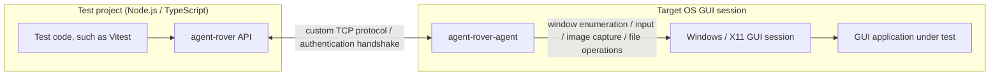

# agent-rover

A multi-platform TypeScript test driver for GUI applications


[](https://www.repostatus.org/#wip)
[](https://opensource.org/licenses/MIT)
[](https://www.npmjs.com/package/agent-rover)

---

[(For Japanese language/日本語はこちら)](./README_ja.md)

> Please note that this English version of the document was machine-translated and then partially edited, so it may contain inaccuracies.
> We welcome pull requests to correct any errors in the text.

## What Is This?

Few problems are as painful as automated testing for GUI applications on Windows and X11.
agent-rover provides a driver interface for automated tests written in TypeScript in these environments.

> WIP: X11 agent



agent-rover provides small agent programs that can be used in Windows and X11 environments.
By starting an agent on the target OS, you can remotely operate applications from a Node.js environment through a Jest-like testing interface.
In other words, the operations that we humans perform against applications in a remote session over RDP can be done through an API.

With agent-rover, you can write test code like this:

```typescript
import { writeFile } from 'node:fs/promises';

import { connectRemoteAgent } from 'agent-rover';

// Connect to the remote agent.
const agent = await connectRemoteAgent({
  host: 'test-agent.example.com', // Target host.
  authToken: '<access-token>', // Access token.
});

// Save a file in the remote environment.
await agent.files.writeFile(
  String.raw`C:\test.txt`,
  Buffer.from('test text file')
);

// Launch the application.
const launchedProcess = await agent.applications.launch({
  path: 'notepad.exe',
});

// Get the application window.
const notepadWindow = await agent.waitForWindow({
  processId: launchedProcess.id,
  visible: true,
});

// Activate the application.
await notepadWindow.activate();

// Enter text by simulating keyboard typing.
await agent.keyboard.pasteText('Here is a remote message');

// Capture the window image and save it.
const screenshot = await notepadWindow.screenshot();
await writeFile('capture.png', screenshot.image);
```

In addition to observing and operating GUI applications themselves, agent-rover also includes APIs for operating the target GUI session.
As shown in the example above, you can send and receive files and launch applications.

## Features

- Place the agent application on a remote machine and drive test operations remotely.
- Launch, discover, operate, and inspect the state of target GUI applications.
  File operations, such as sending and receiving files, are also supported.
- Prebuilt agents are available for Windows (i686/amd64 on XP SP2 or later) and Linux X11 (i686/amd64/armv7l/arm64/riscv64).
- Agent communication uses a custom TCP protocol.
  Authentication uses a digest handshake, although the protocol messages themselves are not encrypted.
- Image recognition assertions for exact or close matches, and OCR-based assertions.

---

## Preparation

Download the agent for the target platform from the [releases page](https://github.com/kekyo/agent-rover/releases/).
The agent is very small and avoids runtime dependencies on other libraries as much as possible.
After extracting the archive, you can run it as-is. No installation is required.

For example, you can start the Windows agent as follows.
When it starts, it prints the listening address and access token:

```cmd
C:\> agent-rover-agent.exe

agent-rover native windows agent
Copyright (c) Kouji Matsui (@kekyo@mi.kekyo.net)
https://github.com/kekyo/agent-rover
Licence: Under MIT.

agent-rover native agent listening on 0.0.0.0:39397
agent-rover agent token: <access-token>
```

- When the agent starts, it prints an access token. Make a note of it.
- The default TCP port is 39397. You need to open it in the OS firewall.
- The Windows agent must be started from the user's interactive desktop so it can operate the desktop environment.
  This is a subtle issue, but launching a process from a Windows service restricts the desktop environment, so running the Windows agent as a service is not recommended.

Then install agent-rover in your npm project:

```bash
npm install -D agent-rover
```

You can use any test framework.
For example, with Vitest, you can write the following:

```typescript
import { describe, expect, it } from 'vitest';
import { connectRemoteAgent } from 'agent-rover';

describe('remote agent smoke test', () => {
  it('finds a running Notepad window', async () => {
    // Connect to the remote agent.
    const agent = await connectRemoteAgent({
      host: '192.0.2.10',
      authToken: '<access-token>',
    });

    try {
      // Enumerate windows.
      const windows = await agent.windows();
      // Is notepad.exe running?
      const hasNotepad = windows.some((window) => {
        return (
          window.visible && window.process.name.toLowerCase() === 'notepad.exe'
        );
      });
      expect(hasNotepad).toBe(true);
    } finally {
      // Release the remote agent.
      agent.release();
    }
  });
});
```

### Network Path Notes

When your tests are finished, stop the agent as soon as possible.
Although the agent uses digest authentication with an access token, if a third party succeeds in accessing it, they may be able to operate the system easily.

Authentication uses hashed data, but agent operations after authentication are not encrypted.
Be especially careful if you perform operations that would be problematic if leaked.

The preferred setup is to run the agent inside a virtual machine placed on the same host.

> The communication path uses TCP with a custom protocol, rather than HTTPS or a similar protocol, to reduce the agent's library dependencies as much as possible.
> For example, the Windows agent targets Windows XP SP2 and later, which makes it possible to automate tests for older GUI applications.
> Future improvements may address this limitation.

---

## Reference

agent-rover does not depend on a specific test framework.
The following is an overview of the APIs you can use from test code.
In code examples, an already connected `RemoteAgent` is referred to as `agent` when needed.

### Connection And Screen Operations

| API | Description |
| :-- | :-- |
| `connectRemoteAgent(options)` | Connects to the remote agent and returns a `RemoteAgent`. |
| `RemoteAgent.capabilities()` | Gets the connected agent's protocol version, platform, and feature list. |
| `RemoteAgent.release()` | Closes the connection to the remote agent. |
| `RemoteAgent.bounds()` | Gets the rectangle of the entire virtual screen. |
| `RemoteAgent.monitors()` | Gets the connected session's monitor list, work areas, and scale factors. |
| `RemoteAgent.cursor()` | Gets the current cursor position and visibility state. |
| `RemoteAgent.screenshot(options?)` | Captures the whole screen, or a specified rectangle, as a PNG image. |

- Pass the agent `host`, `port`, and, as needed, `authToken` and `timeoutMs` to `connectRemoteAgent()`.
- If `authToken` is omitted, the `AGENT_ROVER_AUTH_TOKEN` environment variable can also be used.

Code example:

```typescript
import { writeFile } from 'node:fs/promises';

import { connectRemoteAgent } from 'agent-rover';

// Connect to the remote agent.
const agent = await connectRemoteAgent({
  host: '192.0.2.10',
  port: 39397,
  authToken: process.env.AGENT_ROVER_AUTH_TOKEN,
  timeoutMs: 30000,
});

try {
  // Get the agent's capabilities and protocol information.
  const capabilities = await agent.capabilities();
  console.log(
    `connected to ${capabilities.platform} (${capabilities.protocolVersion})`
  );

  // Get the screen, monitor, and cursor state.
  const bounds = await agent.bounds();
  const monitors = await agent.monitors();
  const cursor = await agent.cursor();
  console.log({ bounds, monitors, cursor });

  // Capture the entire screen and save it locally.
  const screenshot = await agent.screenshot({
    rect: bounds,
  });
  await writeFile('test-results/screen.png', screenshot.image);
} finally {
  // Release the connection to the remote agent.
  agent.release();
}
```

### Window Discovery And Operations

| API | Description |
| :-- | :-- |
| `RemoteAgent.windows()` | Gets the list of top-level windows. |
| `RemoteAgent.findWindows(query)` | Searches for windows by title, process, visibility, and other criteria. |
| `RemoteAgent.waitForWindow(query, options?)` | Waits until a matching window is found and returns the first `AppWindow`. |
| `RemoteAgent.waitForNoWindow(query, options?)` | Waits until no matching windows remain. |
| `AppWindow.refresh()` | Refreshes the window information. |
| `AppWindow.activate()` / `AppWindow.focus()` | Brings the window to the foreground, or gives it keyboard focus. |
| `AppWindow.minimize()` / `AppWindow.maximize()` / `AppWindow.restore()` | Minimizes, maximizes, or restores the window. |
| `AppWindow.setBounds(bounds)` | Changes the window position and size. |
| `AppWindow.children()` / `AppWindow.descendants(options?)` | Gets child windows, or descendant windows. |
| `AppWindow.findDescendants(query)` | Searches descendant windows by criteria. |
| `AppWindow.screenshot()` | Captures the window area as a PNG image. |
| `AppWindow.waitForVisible(options?)` | Waits until the window becomes visible. |
| `AppWindow.waitForHidden(options?)` / `AppWindow.waitForClosed(options?)` | Waits until the window becomes hidden, or until it closes. |
| `AppWindow.waitForStableBounds(options?)` | Waits until the window rectangle stabilizes. |
| `AppWindow.close()` | Sends a close request to the window. |

- `RemoteWindowQuery` accepts `title`, `titleRegex`, `processId`, `processName`, `visible`, `active`,
  `className`, `controlId`, `focused`, `includeDescendants`, and `strict`.
- If `strict: true` is specified, an error is thrown unless the search result has exactly one item.

Code example:

```typescript
// Launch the application.
const launchedProcess = await agent.applications.launch({
  path: 'notepad.exe',
});

// Wait until the launched process shows a window.
const notepadWindow = await agent.waitForWindow(
  {
    processId: launchedProcess.id,
    visible: true,
  },
  {
    intervalMs: 250,
    message: 'Timed out waiting for Notepad window.',
    timeoutMs: 15000,
  }
);

// Bring the window to the foreground and resize/reposition it for testing.
await notepadWindow.activate();
await notepadWindow.setBounds({
  x: 80,
  y: 80,
  width: 800,
  height: 600,
});

// Wait until the rectangle stabilizes after resizing.
const stableWindow = await notepadWindow.waitForStableBounds({
  stableIterations: 3,
});

// Search for windows by process name and visibility.
const visibleNotepadWindows = await agent.findWindows({
  processName: 'notepad.exe',
  visible: true,
});
expect(visibleNotepadWindows.length).toBeGreaterThan(0);

// Find the edit control among descendant windows and focus it.
const editControls = await stableWindow.findDescendants({
  className: 'Edit',
  visible: true,
});
await editControls[0]?.focus();

// Capture the window area.
const windowCapture = await stableWindow.screenshot();
expect(windowCapture.visibleBounds.width).toBeGreaterThan(0);

// Close the window and wait until it is closed.
await stableWindow.close();
await agent.waitForNoWindow(
  {
    processId: launchedProcess.id,
  },
  {
    timeoutMs: 5000,
  }
);
```

### Applications And Processes

| API | Description |
| :-- | :-- |
| `RemoteAgent.applications.launch(options)` | Launches an application in the connected session and returns process information. |
| `RemoteAgent.processes.launchManaged(options)` | Launches a process and returns a managed lifecycle handle. |
| `RemoteAgent.processes.snapshot(processId)` | Gets the current state of a process. |
| `RemoteAgent.processes.exists(processId)` | Gets whether a process is running. |
| `RemoteAgent.processes.list(options?)` | Gets the list of running processes. |
| `RemoteAgent.processes.kill(processId)` | Terminates a process. |
| `RemoteAgent.processes.waitForExit(processId, options?)` | Waits until a process exits. |

- `applications.launch()` accepts `path`, `arguments`, `workingDirectory`, `environment`, `stdoutPath`,
  `stderrPath`, and `createNoWindow`.
- `processes.launchManaged()` accepts `path`, `arguments`, `workingDirectory`, `environment`,
  `captureStdout`, `captureStderr`, `createNoWindow`, and `killTreeOnRelease`.

Code example:

```typescript
// Launch the application in the connected session.
const launchedProcess = await agent.applications.launch({
  arguments: [],
  path: 'notepad.exe',
  workingDirectory: String.raw`C:\Windows`,
});

// Check the process state immediately after launch.
const snapshot = await agent.processes.snapshot(launchedProcess.id);
expect(snapshot.running).toBe(true);

// Find the launched process from the process list.
const notepadProcesses = await agent.processes.list({
  name: 'notepad.exe',
});
expect(
  notepadProcesses.some((process) => process.id === launchedProcess.id)
).toBe(true);
expect(await agent.processes.exists(launchedProcess.id)).toBe(true);

// Terminate the process and wait until it exits.
await agent.processes.kill(launchedProcess.id);
const exitedProcess = await agent.processes.waitForExit(
  launchedProcess.id,
  {
    intervalMs: 250,
    timeoutMs: 5000,
  }
);
expect(exitedProcess.running).toBe(false);
```

Managed process example:

```typescript
const process = await agent.processes.launchManaged({
  arguments: ['--run-tests'],
  captureStderr: true,
  captureStdout: true,
  killTreeOnRelease: true,
  path: String.raw`C:\tools\app-under-test.exe`,
  workingDirectory: String.raw`C:\tools`,
});

const result = await process.waitForExit({
  timeoutMs: 30000,
});
expect(result.exitCode).toBe(0);
expect(await process.stdoutText()).toContain('completed');
expect(await process.stderrText()).toBe('');

await process.releaseAsync();
// Or use explicit resource management:
// await process[Symbol.asyncDispose]();
```

### Input And Clipboard

| API | Description |
| :-- | :-- |
| `RemoteAgent.mouse.move(point)` | Moves the mouse cursor. |
| `RemoteAgent.mouse.click(point, options?)` | Performs a mouse click at the specified position. |
| `RemoteAgent.mouse.drag(from, to, options?)` | Performs a drag operation. |
| `RemoteAgent.mouse.wheel(options)` | Performs a mouse wheel operation. |
| `RemoteAgent.keyboard.press(key, options?)` | Presses and releases a key. |
| `RemoteAgent.keyboard.down(key)` / `RemoteAgent.keyboard.up(key)` | Presses only, or releases only, a key. |
| `RemoteAgent.keyboard.type(text)` | Inputs text by simulating keyboard typing. |
| `RemoteAgent.keyboard.pasteText(text, options?)` | Pastes text through the clipboard. |
| `RemoteAgent.clipboard.readText()` / `RemoteAgent.clipboard.writeText(text)` | Reads and writes clipboard text. |
| `RemoteAgent.clipboard.clear()` | Clears the clipboard. |
| `RemoteAgent.clipboard.withText(text, operation)` | Temporarily replaces the clipboard text while running `operation`, then restores the original text afterward. |

- Mouse operations can specify the `left`, `middle`, or `right` button.
- Keyboard modifiers can specify `Alt`, `Control`, `Meta`, or `Shift`.

Code example:

```typescript
// Get the window to receive input.
const notepadWindow = await agent.waitForWindow({
  processName: 'notepad.exe',
  visible: true,
});

// Bring the window to the foreground and click the input position.
await notepadWindow.activate();
const inputPoint = {
  x: notepadWindow.bounds.x + 24,
  y: notepadWindow.bounds.y + 96,
};
await agent.mouse.move(inputPoint);
await agent.mouse.click(inputPoint, {
  button: 'left',
});

// Perform keyboard input and clipboard paste.
await agent.keyboard.type('first line');
await agent.keyboard.press('Enter');
await agent.keyboard.pasteText('second line', {
  restoreClipboard: true,
});

// Paste using temporary clipboard text.
await agent.clipboard.withText('temporary clipboard text', async () => {
  await agent.keyboard.press('a', {
    modifiers: ['Control'],
  });
  await agent.keyboard.press('v', {
    modifiers: ['Control'],
  });
});

// Hold down a key while pressing another key, then always release it.
await agent.keyboard.down('Shift');
try {
  await agent.keyboard.press('End');
} finally {
  await agent.keyboard.up('Shift');
}

// Perform drag and wheel operations.
await agent.mouse.drag(
  inputPoint,
  {
    x: inputPoint.x + 160,
    y: inputPoint.y,
  },
  {
    button: 'left',
  }
);
await agent.mouse.wheel({
  deltaY: -120,
  point: inputPoint,
});

// Read and write the clipboard, then clear it.
const clipboardText = await agent.clipboard.readText();
expect(typeof clipboardText).toBe('string');
await agent.clipboard.writeText('next test input');
await agent.clipboard.clear();
```

### Files, Event Logs, And Diagnostics

| API | Description |
| :-- | :-- |
| `RemoteAgent.files.writeFile(path, data)` | Writes a file to the connected machine. |
| `RemoteAgent.files.readFile(path)` | Reads a file from the connected machine. |
| `RemoteAgent.files.exists(path)` / `RemoteAgent.files.stat(path)` | Checks whether a path exists, or gets its metadata. |
| `RemoteAgent.files.mkdir(path, options?)` | Creates a directory. |
| `RemoteAgent.files.readdir(path)` | Gets the list of directory entries. |
| `RemoteAgent.files.remove(path, options?)` | Removes a file or directory. |
| `RemoteAgent.files.rename(from, to)` | Renames or moves a file or directory. |
| `RemoteAgent.files.mkdtemp(prefix)` | Creates a temporary directory. |
| `RemoteAgent.files.syncDirectory(options)` | Synchronizes a local directory to the connected machine with checksum-based diffing. |
| `RemoteAgent.files.downloadDirectory(options)` | Downloads a remote directory to a local directory. |
| `RemoteAgent.eventLogs.read(query?)` | Gets event logs from the connected machine. |
| `RemoteAgent.diagnostics.capture(options?)` | Collects screen images, window lists, event logs, and recent operation history in memory. |
| `saveDiagnostics(directory, options)` | Saves diagnostics to a local directory. |
| `withDiagnostics(agent, directory, operation, options?)` | Saves diagnostics when `operation` fails, then rethrows the original error. |

Code example:

```typescript
import { saveDiagnostics, withDiagnostics } from 'agent-rover';

// Prepare a temporary directory and file paths on the remote side.
const remoteDirectory = await agent.files.mkdtemp(
  String.raw`C:\agent-rover\case-`
);
const remoteFilePath = `${remoteDirectory}\\input.txt`;
const movedFilePath = `${remoteDirectory}\\moved.txt`;

// Write a file, then check its existence and metadata.
await agent.files.mkdir(remoteDirectory, {
  recursive: true,
});
await agent.files.writeFile(remoteFilePath, Buffer.from('hello'));
expect(await agent.files.exists(remoteFilePath)).toBe(true);

const stat = await agent.files.stat(remoteFilePath);
expect(stat.type).toBe('file');

// Enumerate directory contents.
const entries = await agent.files.readdir(remoteDirectory);
expect(entries.some((entry) => entry.name === 'input.txt')).toBe(true);

// Move the file and check the content read back from it.
await agent.files.rename(remoteFilePath, movedFilePath);
const received = await agent.files.readFile(movedFilePath);
expect(received.toString('utf8')).toBe('hello');

// Synchronize a local runtime directory and collect remote artifacts.
await agent.files.syncDirectory({
  localPath: 'fixtures/runtime',
  remotePath: `${remoteDirectory}\\runtime`,
  mode: 'mirror',
  onLockedFile: 'killRelatedProcessesAndRetry',
});
await agent.files.downloadDirectory({
  remotePath: `${remoteDirectory}\\runtime`,
  localPath: 'test-results/runtime-copy',
});

// Get event logs.
const recentLogs = await agent.eventLogs.read({
  maxEntries: 20,
});
expect(Array.isArray(recentLogs)).toBe(true);

// Collect diagnostics and save them to a local directory.
const capture = await agent.diagnostics.capture({
  eventLogs: {
    maxEntries: 20,
  },
  includeDescendants: true,
  maxDescendantDepth: 2,
});
const saved = await saveDiagnostics('test-results/diagnostics', {
  capture,
  agent,
  attachments: [
    {
      kind: 'remoteFile',
      name: 'moved-input',
      path: movedFilePath,
    },
    {
      kind: 'remoteDirectory',
      name: 'runtime',
      path: `${remoteDirectory}\\runtime`,
    },
  ],
});
expect(saved.artifacts.length).toBeGreaterThan(0);

// Run a block that saves diagnostics on failure.
await withDiagnostics(
  agent,
  'test-results/failure-diagnostics',
  async () => {
    expect(await agent.files.exists(movedFilePath)).toBe(true);
  },
  {
    captureOptions: {
      includeDescendants: true,
    },
  }
);

// Remove the remote directory created for the test.
await agent.files.remove(remoteDirectory, {
  recursive: true,
});
```

### Image Comparison, OCR, And Wait Helpers

| API | Description |
| :-- | :-- |
| `expectCapture(capture, name)` | Creates image comparison and OCR assertions for a screenshot. |
| `createCaptureExpect(defaults?)` | Creates an assertion factory that shares the output destination, variant, and OCR worker settings. |
| `toLookSimilar(expectedImage, options?)` | Compares PNG images with pixelmatch. Supports regions, masks, and diff tolerances. |
| `toHaveSimilarity(expectedImage, options?)` | Compares structural similarity with SSIM. |
| `readText(options?)` | Reads text, word positions, and confidence scores with OCR. |
| `toContainText(expected, options?)` | Checks whether OCR results match the specified string or regular expression. |
| `findText(expected, options?)` | Returns capture coordinates and screen coordinates for the matching OCR words. |
| `compareImages(actualImage, expectedImage, options?)` | Low-level API that compares two PNG images and returns the diff pixel count and pass/fail result. |
| `waitForResult(probe, options?)` | Retries until `probe` succeeds and returns the first successful result. |
| `toPass(probe, options?)` | Retries until the assertion operation succeeds. |

- Import `expectCapture()`, `createCaptureExpect()`, `waitForResult()`, and `toPass()` from `agent-rover/testing`.
- `capture` can be the return value of `AppWindow.screenshot()` or `RemoteAgent.screenshot()`.
  Objects with the same shape, including `image`, `bounds`, `visibleBounds`, and `clipped`, can also be used.
- `expectedImage` can be a `Buffer`, a file path string, or a `file:` URL.
- `toLookSimilar()` and `toHaveSimilarity()` can specify a comparison region with `region`, and regions to ignore with `masks`.
- When artifact output is enabled, `actual.png`, `expected.png`/`diff.png` on failure, `metadata.json`, and `ocr-input.png` for OCR are saved.
- The default artifact output directory can be specified with `AGENT_ROVER_VISUAL_OUTPUT_RESULT_PATH`, and the variant with `AGENT_ROVER_VISUAL_VARIANT`.
  The `outputResultPath` and `variant` options take precedence.
- OCR uses the bundled English data `@tesseract.js-data/eng` by default.
  To use another language, add language data for Tesseract.js as a dependency and specify it with `createCaptureExpect({ ocr: { languages, langPath, gzip } })`.
- OCR workers are created and released for each read by default.
  If you specify `workerMode: 'shared'`, release it at the end with `await captureExpect.releaseAsync()` or `await captureExpect[Symbol.asyncDispose]()`.
- These helpers can be used to wait for results that stabilize asynchronously, such as GUI rendering, window creation, and file saving.

Code example:

```typescript
import { expect } from 'vitest';
import { expectCapture, toPass, waitForResult } from 'agent-rover/testing';

// Retry until the Notepad window is found.
const notepadWindow = await waitForResult(async () => {
  const windows = await agent.windows();
  const window = windows.find((candidate) => {
    return (
      candidate.visible &&
      candidate.process.name.toLowerCase() === 'notepad.exe'
    );
  });
  if (window === undefined) {
    throw new Error('Notepad window was not found.');
  }
  return window;
});

// Retry the assertion until the process exists.
await toPass(async () => {
  expect(await agent.processes.exists(notepadWindow.process.id)).toBe(true);
});

// Use an expected image path and wait until the rendering result matches.
await toPass(
  async () => {
    const screenshot = await notepadWindow.screenshot();
    await expectCapture(screenshot, 'notepad-window').toLookSimilar(
      'test-fixtures/notepad-window.png',
      {
        masks: [
          {
            height: 24,
            width: 160,
            x: 0,
            y: 0,
          },
        ],
        maxDiffRatio: 0.01,
        outputResultPath: 'test-results/visual',
        threshold: 0.1,
        variant: process.platform,
      }
    );
  },
  {
    intervalMs: 250,
    message: 'Timed out waiting for the expected Notepad rendering.',
    timeoutMs: 5000,
  }
);

// Check displayed text with OCR.
const screenshot = await notepadWindow.screenshot();
const captureText = await expectCapture(screenshot, 'notepad-text').readText({
  pageSegmentationModes: ['singleBlock', 'sparseText'],
  preprocess: {
    grayscale: true,
    scale: 2,
    threshold: 180,
  },
});
await captureText.toContainText(/agent-rover/i, {
  minConfidence: 50,
});
const match = await captureText.findText('agent-rover');
expect(match?.screenBounds.width).toBeGreaterThan(0);
```

When using the low-level `compareImages()` API:

```typescript
import { readFile } from 'node:fs/promises';

import { expect } from 'vitest';
import { compareImages } from 'agent-rover';

const screenshot = await notepadWindow.screenshot();
const expectedImage = await readFile('test-fixtures/notepad-window.png');
const comparison = compareImages(screenshot.image, expectedImage, {
  maxDiffRatio: 0.01,
  threshold: 0.1,
});
expect(comparison.pass).toBe(true);
```

---

## Notes

The tools in this project are designed for GUI application developers.

It should go without saying, but they are intended for use by GUI application developers performing automated testing.
Other uses are not recommended, and the project owner and contributors make no warranty for any problems that may occur from such use.

## License

Under MIT.
