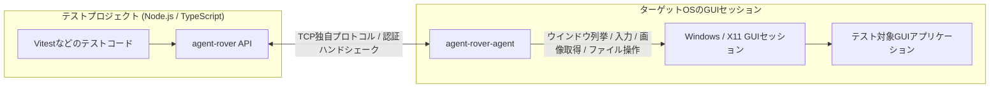

# agent-rover

GUIアプリケーション向けのマルチプラットフォーム対応TypeScriptテストドライバー


[](https://www.repostatus.org/#wip)
[](https://opensource.org/licenses/MIT)
[](https://www.npmjs.com/package/agent-rover)

---

[(English language is here)](./README.md)

## これは何？

WindowsやX11において、GUIアプリケーションの自動化テストほど頭の痛い問題はありません。
agent-roverはこれらの環境で、TypeScriptを使用した自動化テストのドライバーインターフェイスを提供します。

> WIP: X11エージェント



agent-roverには、WindowsとX11環境で使用できる小さな「エージェントプログラム」が用意されており、
これをターゲットのOSで起動しておくことで、Node.js環境からjestライクなテストインターフェイスを通じて、アプリケーションのリモート操作を可能にします。
つまり、我々人間がRDPを通じてリモートセッションでアプリケーションを操作したりする事を、
APIで実現できるということです！

agent-roverを使用すれば、テストコードを以下のように書けます:

```typescript
import { connectRemoteAgent } from 'agent-rover';
import { waitForResult } from 'agent-rover/testing';

// リモートエージェントに接続する
const agent = await connectRemoteAgent({
  host: 'test-agent.example.com',  // ターゲットのホスト
  authToken: '<access-token>',     // アクセストークン
});

// リモート環境にファイルを保存
await agent.files.writeFile(`C:\test.txt`, Buffer.from('test text file'));

// アプリケーションを起動
const launchedProcess = await agent.applications.launch({
  path: 'notepad.exe',
});

// アプリケーションのウインドウを取得
const notepadWindow = await agent.waitForWindow({
  processId: launchedProcess.id,
  visible: true,
});

// アプリケーションをアクティブ状態にする
await notepadWindow.activate();

// キー入力（キーボードタイプをシミュレート）
await agent.keyboard.pasteText('Here is a remote message');

// ウインドウの画像キャプチャを取得して保存
const screenshot = await notepadWindow.screenshot();
await writeFile('capture.png', screenshot.image);
```

agent-roverは、GUIアプリケーション自体の監視や操作以外にも、
ターゲットのGUIセッションを操作する関数群も備えています。
上記の例のように、ファイルの送受信を行うことや、アプリケーションの実行も可能です。

## 特徴

- リモートマシンにエージェントアプリケーションを配置し、リモートからテスト操作が可能。
- ターゲットGUIアプリケーションの実行・探索・操作・状態の取得が可能。
  ファイル操作（送受信）も可能。
- プリビルドエージェントは Windows (XP SP2以降のi686/amd64)・Linux X11 (i686/amd64/armv7l/arm64/riscv64) を使用可能。
- エージェントとの通信はTCP独自プロトコル。認証はダイジェストハンドシェーク（但し通信電文自体は非暗号化）。
- 画像認識（一致または近しい）・OCR解析アサーション。

---

## 準備

[リリースページ](https://github.com/kekyo/agent-rover/releases/) から、ターゲットプラットフォームに対応するエージェントをダウンロードして下さい。
エージェントは非常に小さく、そして他のライブラリへの実行時依存を可能な限り取り除いてあります。アーカイブを展開後、そのまま実行できます。インストールも不要です。

例えば、Windowsエージェントの場合、以下のように起動できます。
起動すると、以下のように待ち受けアドレスとアクセストークンが表示されます:

```cmd
C:\> agent-rover-agent.exe

agent-rover native windows agent
Copyright (c) Kouji Matsui (@kekyo@mi.kekyo.net)
https://github.com/kekyo/agent-rover
Licence: Under MIT.

agent-rover native agent listening on 0.0.0.0:39397
agent-rover agent token: <access-token>
```

- エージェントを実行するとアクセストークンが表示されるので、これをメモして下さい。
- デフォルトのTCPポート番号は39397です。OSファイアーウォールは開ける必要があります。
- Windowsエージェントは、デスクトップ環境を操作するために、ユーザーのインタラクティブデスクトップから起動する必要があります。
  わかりにくい問題ですが、Windowsサービスからプロセスを起動するとデスクトップ環境が制限されるため、Windowsエージェントをサービス化することはお勧めしません。

その後、あなたのNPMプロジェクトで、agent-roverをインストールします:

```bash
npm install -D agent-rover
```

テストフレームワークは何を使用しても構いません。例えば、Vitestを使用して、以下のように書きます:

```typescript
import { describe, expect, it } from 'vitest';
import { connectRemoteAgent } from 'agent-rover';

describe('remote agent smoke test', () => {
  it('finds a running Notepad window', async () => {
    // リモートエージェントに接続
    const agent = await connectRemoteAgent({
      host: '192.0.2.10',
      authToken: '<access-token>',
    });

    try {
      // ウインドウ群を列挙
      const windows = await agent.windows();
      // notepad.exeが起動しているか?
      const hasNotepad = windows.some((window) => {
        return (
          window.visible && window.process.name.toLowerCase() === 'notepad.exe'
        );
      });
      expect(hasNotepad).toBe(true);
    } finally {
      // リモートエージェントを解放
      agent.release();
    }
  });
});
```

### ネットワーク経路の注意

テストが終わったら、エージェントを速やかに終了させて下さい。
アクセストークンによるダイジェスト認証を行っていますが、万が一第三者がアクセスに成功した場合、容易にシステムを操作出来る可能性があります。

また、認証はハッシュ化されたデータを用いますが、認証後のエージェント操作は暗号化されていません。
漏洩すると問題のある操作を行う場合は、特に注意して下さい。

最も望ましいのは、同じマシンに配置された仮想マシン上で動作させることです。

> 通信経路をHTTPSなどではなく、TCP＋独自のプロトコルとしている理由は、エージェントのライブラリ依存性を極限まで下げるためです。
> 例えばWindowsエージェントでは、動作対象が Windows XP SP2 以上となっており、これにより古いGUIアプリケーションのテスト自動化を行うことが出来ます。
> 但し、今後の強化でこの問題を改善させる可能性はあります。

---

## リファレンス

agent-roverは特定のテストフレームワークに依存しません。
以下は、テストコードから使用出来るAPIの概要です。
コード例では、必要に応じて接続済みの`RemoteAgent`を`agent`として扱います。

### 接続と画面操作

| API | 内容 |
| :-- | :-- |
| `connectRemoteAgent(options)` | リモートエージェントへ接続し、`RemoteAgent`を返します。 |
| `RemoteAgent.capabilities()` | 接続先エージェントのプロトコルバージョン、プラットフォーム、機能一覧を取得します。 |
| `RemoteAgent.release()` | リモートエージェントとの接続を閉じます。 |
| `RemoteAgent.bounds()` | 仮想画面全体の矩形を取得します。 |
| `RemoteAgent.monitors()` | 接続先セッションのモニター一覧、作業領域、スケール係数を取得します。 |
| `RemoteAgent.cursor()` | 現在のカーソル位置と表示状態を取得します。 |
| `RemoteAgent.screenshot(options?)` | 画面全体、または指定矩形をPNG画像としてキャプチャします。 |

- `connectRemoteAgent()`には、エージェントの`host`、`port`、必要に応じて`authToken`と`timeoutMs`を指定します。
- `authToken`を省略した場合は、環境変数`AGENT_ROVER_AUTH_TOKEN`も使用できます。

コード例:

```typescript
import { writeFile } from 'node:fs/promises';

import { connectRemoteAgent } from 'agent-rover';

// リモートエージェントに接続
const agent = await connectRemoteAgent({
  host: '192.0.2.10',
  port: 39397,
  authToken: process.env.AGENT_ROVER_AUTH_TOKEN,
  timeoutMs: 30000,
});

try {
  // エージェントの機能とプロトコル情報を取得
  const capabilities = await agent.capabilities();
  console.log(
    `connected to ${capabilities.platform} (${capabilities.protocolVersion})`
  );

  // 画面、モニター、カーソルの状態を取得
  const bounds = await agent.bounds();
  const monitors = await agent.monitors();
  const cursor = await agent.cursor();
  console.log({ bounds, monitors, cursor });

  // 画面全体をキャプチャしてローカルに保存
  const screenshot = await agent.screenshot({
    rect: bounds,
  });
  await writeFile('test-results/screen.png', screenshot.image);
} finally {
  // リモートエージェントとの接続を解放
  agent.release();
}
```

### ウインドウ探索と操作

| API | 内容 |
| :-- | :-- |
| `RemoteAgent.windows()` | トップレベルウインドウの一覧を取得します。 |
| `RemoteAgent.findWindows(query)` | タイトル、プロセス、可視状態などでウインドウを検索します。 |
| `RemoteAgent.waitForWindow(query, options?)` | 条件に一致するウインドウが見つかるまで待機し、最初の`AppWindow`を返します。 |
| `RemoteAgent.waitForNoWindow(query, options?)` | 条件に一致するウインドウが無くなるまで待機します。 |
| `AppWindow.refresh()` | ウインドウ情報を再取得します。 |
| `AppWindow.activate()` / `AppWindow.focus()` | ウインドウを前面化、またはキーボードフォーカス設定します。 |
| `AppWindow.minimize()` / `AppWindow.maximize()` / `AppWindow.restore()` | ウインドウの最小化、最大化、復元を行います。 |
| `AppWindow.setBounds(bounds)` | ウインドウ位置とサイズを変更します。 |
| `AppWindow.children()` / `AppWindow.descendants(options?)` | 子ウインドウ、または子孫ウインドウを取得します。 |
| `AppWindow.findDescendants(query)` | 子孫ウインドウを条件で検索します。 |
| `AppWindow.screenshot()` | ウインドウ領域をPNG画像としてキャプチャします。 |
| `AppWindow.waitForVisible(options?)` | ウインドウが表示状態になるまで待機します。 |
| `AppWindow.waitForHidden(options?)` / `AppWindow.waitForClosed(options?)` | ウインドウが非表示、または閉じられるまで待機します。 |
| `AppWindow.waitForStableBounds(options?)` | ウインドウ矩形が安定するまで待機します。 |
| `AppWindow.close()` | ウインドウにクローズ要求を送ります。 |

- `RemoteWindowQuery`では、`title`、`titleRegex`、`processId`、`processName`、`visible`、`active`、
- `className`、`controlId`、`focused`、`includeDescendants`、`strict`を指定できます。
- `strict: true`を指定すると、検索結果が1件ではない場合にエラーになります。

コード例:

```typescript
// アプリケーションを起動
const launchedProcess = await agent.applications.launch({
  path: 'notepad.exe',
});

// 起動したプロセスのウインドウが表示されるまで待機
const notepadWindow = await agent.waitForWindow(
  {
    processId: launchedProcess.id,
    visible: true,
  },
  {
    intervalMs: 250,
    message: 'Timed out waiting for Notepad window.',
    timeoutMs: 15000,
  }
);

// ウインドウを前面化し、テストしやすい位置とサイズに変更
await notepadWindow.activate();
await notepadWindow.setBounds({
  x: 80,
  y: 80,
  width: 800,
  height: 600,
});

// リサイズ後の矩形が安定するまで待機
const stableWindow = await notepadWindow.waitForStableBounds({
  stableIterations: 3,
});

// プロセス名と可視状態でウインドウを検索
const visibleNotepadWindows = await agent.findWindows({
  processName: 'notepad.exe',
  visible: true,
});
expect(visibleNotepadWindows.length).toBeGreaterThan(0);

// 子孫ウインドウから編集コントロールを探してフォーカス
const editControls = await stableWindow.findDescendants({
  className: 'Edit',
  visible: true,
});
await editControls[0]?.focus();

// ウインドウ領域をキャプチャ
const windowCapture = await stableWindow.screenshot();
expect(windowCapture.visibleBounds.width).toBeGreaterThan(0);

// ウインドウを閉じ、閉じ終わるまで待機
await stableWindow.close();
await agent.waitForNoWindow(
  {
    processId: launchedProcess.id,
  },
  {
    timeoutMs: 5000,
  }
);
```

### アプリケーションとプロセス

| API | 内容 |
| :-- | :-- |
| `RemoteAgent.applications.launch(options)` | 接続先セッションでアプリケーションを起動し、プロセス情報を返します。 |
| `RemoteAgent.processes.snapshot(processId)` | プロセスの現在状態を取得します。 |
| `RemoteAgent.processes.exists(processId)` | プロセスが実行中かどうかを取得します。 |
| `RemoteAgent.processes.list(options?)` | 実行中プロセスの一覧を取得します。 |
| `RemoteAgent.processes.kill(processId)` | プロセスを終了します。 |
| `RemoteAgent.processes.waitForExit(processId, options?)` | プロセス終了まで待機します。 |

- `applications.launch()`には、`path`、`arguments`、`workingDirectory`、`environment`、`stdoutPath`、
- `stderrPath`、`createNoWindow`を指定できます。

コード例:

```typescript
// 接続先セッションでアプリケーションを起動
const launchedProcess = await agent.applications.launch({
  arguments: [],
  path: 'notepad.exe',
  workingDirectory: String.raw`C:\Windows`,
});

// 起動直後のプロセス状態を確認
const snapshot = await agent.processes.snapshot(launchedProcess.id);
expect(snapshot.running).toBe(true);

// プロセス一覧から起動したプロセスを探す
const notepadProcesses = await agent.processes.list({
  name: 'notepad.exe',
});
expect(
  notepadProcesses.some((process) => process.id === launchedProcess.id)
).toBe(true);
expect(await agent.processes.exists(launchedProcess.id)).toBe(true);

// プロセスを終了し、終了状態になるまで待機
await agent.processes.kill(launchedProcess.id);
const exitedProcess = await agent.processes.waitForExit(
  launchedProcess.id,
  {
    intervalMs: 250,
    timeoutMs: 5000,
  }
);
expect(exitedProcess.running).toBe(false);
```

### 入力とクリップボード

| API | 内容 |
| :-- | :-- |
| `RemoteAgent.mouse.move(point)` | マウスカーソルを移動します。 |
| `RemoteAgent.mouse.click(point, options?)` | 指定位置でマウスクリックを発生させます。 |
| `RemoteAgent.mouse.drag(from, to, options?)` | ドラッグ操作を発生させます。 |
| `RemoteAgent.mouse.wheel(options)` | マウスホイール操作を発生させます。 |
| `RemoteAgent.keyboard.press(key, options?)` | キーの押下と解放を行います。 |
| `RemoteAgent.keyboard.down(key)` / `RemoteAgent.keyboard.up(key)` | キーの押下、または解放だけを行います。 |
| `RemoteAgent.keyboard.type(text)` | キーボードタイプをシミュレートして文字列を入力します。 |
| `RemoteAgent.keyboard.pasteText(text, options?)` | クリップボードを利用して文字列を貼り付けます。 |
| `RemoteAgent.clipboard.readText()` / `RemoteAgent.clipboard.writeText(text)` | クリップボード文字列を読み書きします。 |
| `RemoteAgent.clipboard.clear()` | クリップボードをクリアします。 |
| `RemoteAgent.clipboard.withText(text, operation)` | 一時的にクリップボード文字列を差し替えて処理を実行し、終了後に元へ戻します。 |

- マウス操作では`left`、`middle`、`right`ボタンを指定できます。
- キーボード修飾キーには`Alt`、`Control`、`Meta`、`Shift`を指定できます。

コード例:

```typescript
// 入力対象のウインドウを取得
const notepadWindow = await agent.waitForWindow({
  processName: 'notepad.exe',
  visible: true,
});

// ウインドウを前面化し、入力したい位置をクリック
await notepadWindow.activate();
const inputPoint = {
  x: notepadWindow.bounds.x + 24,
  y: notepadWindow.bounds.y + 96,
};
await agent.mouse.move(inputPoint);
await agent.mouse.click(inputPoint, {
  button: 'left',
});

// キーボード入力とクリップボード貼り付けを実行
await agent.keyboard.type('first line');
await agent.keyboard.press('Enter');
await agent.keyboard.pasteText('second line', {
  restoreClipboard: true,
});

// 一時的なクリップボード文字列を使って貼り付け
await agent.clipboard.withText('temporary clipboard text', async () => {
  await agent.keyboard.press('a', {
    modifiers: ['Control'],
  });
  await agent.keyboard.press('v', {
    modifiers: ['Control'],
  });
});

// キーを押したまま別のキーを押し、最後に必ず解放
await agent.keyboard.down('Shift');
try {
  await agent.keyboard.press('End');
} finally {
  await agent.keyboard.up('Shift');
}

// ドラッグとホイール操作を実行
await agent.mouse.drag(
  inputPoint,
  {
    x: inputPoint.x + 160,
    y: inputPoint.y,
  },
  {
    button: 'left',
  }
);
await agent.mouse.wheel({
  deltaY: -120,
  point: inputPoint,
});

// クリップボードを読み書きし、最後にクリア
const clipboardText = await agent.clipboard.readText();
expect(typeof clipboardText).toBe('string');
await agent.clipboard.writeText('next test input');
await agent.clipboard.clear();
```

### ファイル、イベントログ、診断

| API | 内容 |
| :-- | :-- |
| `RemoteAgent.files.writeFile(path, data)` | 接続先マシンへファイルを書き込みます。 |
| `RemoteAgent.files.readFile(path)` | 接続先マシンからファイルを読み込みます。 |
| `RemoteAgent.files.exists(path)` / `RemoteAgent.files.stat(path)` | パスの存在確認、またはメタデータ取得を行います。 |
| `RemoteAgent.files.mkdir(path, options?)` | ディレクトリを作成します。 |
| `RemoteAgent.files.readdir(path)` | ディレクトリエントリ一覧を取得します。 |
| `RemoteAgent.files.remove(path, options?)` | ファイル、またはディレクトリを削除します。 |
| `RemoteAgent.files.rename(from, to)` | ファイル、またはディレクトリをリネーム・移動します。 |
| `RemoteAgent.files.mkdtemp(prefix)` | 一時ディレクトリを作成します。 |
| `RemoteAgent.eventLogs.read(query?)` | 接続先マシンのイベントログを取得します。 |
| `RemoteAgent.diagnostics.capture(options?)` | 画面画像、ウインドウ一覧、イベントログ、最近の操作履歴をメモリ上に収集します。 |
| `saveDiagnostics(directory, options)` | 診断情報をローカルディレクトリに保存します。 |
| `withDiagnostics(agent, directory, operation, options?)` | `operation`が失敗した場合に診断情報を保存し、元のエラーを再送出します。 |

コード例:

```typescript
import { saveDiagnostics, withDiagnostics } from 'agent-rover';

// リモート側にテスト用の一時ディレクトリとファイルパスを用意
const remoteDirectory = await agent.files.mkdtemp(
  String.raw`C:\agent-rover\case-`
);
const remoteFilePath = `${remoteDirectory}\\input.txt`;
const movedFilePath = `${remoteDirectory}\\moved.txt`;

// ファイルを書き込み、存在とメタデータを確認
await agent.files.mkdir(remoteDirectory, {
  recursive: true,
});
await agent.files.writeFile(remoteFilePath, Buffer.from('hello'));
expect(await agent.files.exists(remoteFilePath)).toBe(true);

const stat = await agent.files.stat(remoteFilePath);
expect(stat.type).toBe('file');

// ディレクトリ内容を列挙
const entries = await agent.files.readdir(remoteDirectory);
expect(entries.some((entry) => entry.name === 'input.txt')).toBe(true);

// ファイルを移動し、読み戻した内容を確認
await agent.files.rename(remoteFilePath, movedFilePath);
const received = await agent.files.readFile(movedFilePath);
expect(received.toString('utf8')).toBe('hello');

// イベントログを取得
const recentLogs = await agent.eventLogs.read({
  maxEntries: 20,
});
expect(Array.isArray(recentLogs)).toBe(true);

// 診断情報を収集してローカルディレクトリへ保存
const capture = await agent.diagnostics.capture({
  eventLogs: {
    maxEntries: 20,
  },
  includeDescendants: true,
  maxDescendantDepth: 2,
});
const saved = await saveDiagnostics('test-results/diagnostics', {
  capture,
});
expect(saved.artifacts.length).toBeGreaterThan(0);

// 失敗時に診断情報を保存するブロックとして実行
await withDiagnostics(
  agent,
  'test-results/failure-diagnostics',
  async () => {
    expect(await agent.files.exists(movedFilePath)).toBe(true);
  },
  {
    captureOptions: {
      includeDescendants: true,
    },
  }
);

// テスト用に作成したリモート側ディレクトリを削除
await agent.files.remove(remoteDirectory, {
  recursive: true,
});
```

### 画像比較、OCR、待機ヘルパー

| API | 内容 |
| :-- | :-- |
| `expectCapture(capture, name)` | スクリーンショットに対する画像比較/OCRアサーションを作成します。 |
| `createCaptureExpect(defaults?)` | 出力先、variant、OCR worker設定を共有するアサーションファクトリを作成します。 |
| `toLookSimilar(expectedImage, options?)` | pixelmatchベースでPNGを比較します。領域指定、マスク、差分許容値に対応します。 |
| `toHaveSimilarity(expectedImage, options?)` | SSIMベースで構造類似度を比較します。 |
| `readText(options?)` | OCRで文字列、単語位置、信頼度を読み取ります。 |
| `toContainText(expected, options?)` | OCR結果が指定文字列または正規表現に一致することを確認します。 |
| `findText(expected, options?)` | OCR済み単語から一致箇所のキャプチャ座標と画面座標を返します。 |
| `compareImages(actualImage, expectedImage, options?)` | 2つのPNG画像を比較し、差分ピクセル数と判定結果を返す低水準APIです。 |
| `waitForResult(probe, options?)` | `probe`が成功するまでリトライし、最初の成功結果を返します。 |
| `toPass(probe, options?)` | アサーション処理が成功するまでリトライします。 |

- `expectCapture()`、`createCaptureExpect()`、`waitForResult()`、`toPass()`は`agent-rover/testing`からインポートします。
- `capture`には`AppWindow.screenshot()`または`RemoteAgent.screenshot()`の戻り値を渡せます。`image`, `bounds`, `visibleBounds`, `clipped`を持つ同じ形のオブジェクトも使用できます。
- `expectedImage`には`Buffer`、ファイルパス文字列、`file:` URLを渡せます。
- `toLookSimilar()`と`toHaveSimilarity()`は`region`で比較領域を指定でき、`masks`で差分を無視する領域を指定できます。
- 成果物出力を有効にすると、`actual.png`、失敗時の`expected.png`/`diff.png`、`metadata.json`、OCR時の`ocr-input.png`を保存します。
- 既定の成果物出力先は`AGENT_ROVER_VISUAL_OUTPUT_RESULT_PATH`、variantは`AGENT_ROVER_VISUAL_VARIANT`で指定できます。オプションの`outputResultPath`と`variant`が優先されます。
- OCRは既定で同梱の英語データ`@tesseract.js-data/eng`を使います。他言語を使う場合はTesseract.js用の言語データを依存関係に追加し、`createCaptureExpect({ ocr: { languages, langPath, gzip } })`で指定してください。
- OCR workerは既定で読み取りごとに作成/解放されます。`workerMode: 'shared'`を指定した場合は、最後に`await captureExpect.release()`または`await captureExpect[Symbol.asyncDispose]()`で解放してください。
- GUIの描画、ウインドウ生成、ファイル保存など、結果が非同期に安定する処理の待機に使用できます。

コード例:

```typescript
import { expect } from 'vitest';
import { expectCapture, toPass, waitForResult } from 'agent-rover/testing';

// Notepadウインドウが見つかるまでリトライ
const notepadWindow = await waitForResult(async () => {
  const windows = await agent.windows();
  const window = windows.find((candidate) => {
    return (
      candidate.visible &&
      candidate.process.name.toLowerCase() === 'notepad.exe'
    );
  });
  if (window === undefined) {
    throw new Error('Notepad window was not found.');
  }
  return window;
});

// プロセスが存在する状態になるまでアサーションをリトライ
await toPass(async () => {
  expect(await agent.processes.exists(notepadWindow.process.id)).toBe(true);
});

// 期待画像パスを使い、レンダリング結果が一致するまで待機
await toPass(
  async () => {
    const screenshot = await notepadWindow.screenshot();
    await expectCapture(screenshot, 'notepad-window').toLookSimilar(
      'test-fixtures/notepad-window.png',
      {
        masks: [
          {
            height: 24,
            width: 160,
            x: 0,
            y: 0,
          },
        ],
        maxDiffRatio: 0.01,
        outputResultPath: 'test-results/visual',
        threshold: 0.1,
        variant: process.platform,
      }
    );
  },
  {
    intervalMs: 250,
    message: 'Timed out waiting for the expected Notepad rendering.',
    timeoutMs: 5000,
  }
);

// OCRで表示テキストを確認
const screenshot = await notepadWindow.screenshot();
const captureText = await expectCapture(screenshot, 'notepad-text').readText({
  pageSegmentationModes: ['singleBlock', 'sparseText'],
  preprocess: {
    grayscale: true,
    scale: 2,
    threshold: 180,
  },
});
await captureText.toContainText(/agent-rover/i, {
  minConfidence: 50,
});
const match = await captureText.findText('agent-rover');
expect(match?.screenBounds.width).toBeGreaterThan(0);
```

低水準の`compareImages()`を使う場合:

```typescript
import { readFile } from 'node:fs/promises';

import { expect } from 'vitest';
import { compareImages } from 'agent-rover';

const screenshot = await notepadWindow.screenshot();
const expectedImage = await readFile('test-fixtures/notepad-window.png');
const comparison = compareImages(screenshot.image, expectedImage, {
  maxDiffRatio: 0.01,
  threshold: 0.1,
});
expect(comparison.pass).toBe(true);
```

---

## 注意

このプロジェクトのツールは、GUIアプリケーション開発者向けに設計されています。

ここで改めて述べるまでもありませんが、GUIアプリケーション開発者が自動化テストを行う上で使用する事を目的としています。
その他の用途に使用することは推奨しませんし、使用したことによって発生するあらゆる問題について、
プロジェクトのオーナーやコントリビューターからは一切保証はありませんので、ご承知おき下さい。

## License

Under MIT.
