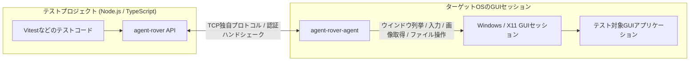

# agent-rover

GUIアプリケーション向けのマルチプラットフォーム対応TypeScriptテストドライバー


[](https://www.repostatus.org/#wip)
[](https://opensource.org/licenses/MIT)
[](https://www.npmjs.com/package/agent-rover)

---

[(English language is here)](./README.md)

## これは何？

WindowsやX11において、GUIアプリケーションの自動化テストほど頭の痛い問題はありません。
agent-roverはこれらの環境で、TypeScriptを使用した自動化テストのドライバーインターフェイスを提供します。

> WIP: X11エージェント



agent-roverには、WindowsとX11環境で使用できる小さな「エージェントプログラム」が用意されており、
これをターゲットのOSで起動しておくことで、Node.js環境からjestライクなテストインターフェイスを通じて、アプリケーションのリモート操作を可能にします。
つまり、我々人間がRDPを通じてリモートセッションでアプリケーションを操作したりする事を、
APIで実現できるということです！

agent-roverを使用すれば、テストコードを以下のように書けます:

```typescript
import { connectRemoteAgent } from 'agent-rover';
import { waitForResult } from 'agent-rover/testing';

// リモートエージェントに接続する
const agent = await connectRemoteAgent({
  host: 'test-agent.example.com',  // ターゲットのホスト
  authToken: '<access-token>',     // アクセストークン
});

// リモート環境にファイルを保存
await agent.files.writeFile(`C:\test.txt`, Buffer.from('test text file'));

// アプリケーションを起動
const process = await agent.processes.launchManaged({
  path: 'notepad.exe',
});

// アプリケーションのウインドウを取得
const notepadWindow = await process.waitForWindow({
  visible: true,
});

// アプリケーションをアクティブ状態にする
await notepadWindow.activate();

// キー入力（キーボードタイプをシミュレート）
await agent.keyboard.pasteText('Here is a remote message');

// ウインドウの画像キャプチャを取得して保存
const screenshot = await notepadWindow.screenshot();
await writeFile('capture.png', screenshot.image);

await process.releaseAsync();
```

agent-roverは、GUIアプリケーション自体の監視や操作以外にも、
ターゲットのGUIセッションを操作する関数群も備えています。
上記の例のように、ファイルの送受信を行うことや、アプリケーションの実行も可能です。

## 特徴

- リモートマシンにエージェントアプリケーションを配置し、リモートからテスト操作が可能。
- ターゲットGUIアプリケーションの実行・探索・操作・状態の取得が可能。
  ファイル操作（送受信）も可能。
- 画面またはアプリケーションウインドウをPNG画像として、対応するWindowsエージェントでは
  H.264 MP4動画としてキャプチャ可能。
- プリビルドエージェントは Windows (XP SP2以降を対象とするi686/amd64)・Linux X11 (i686/amd64/armv7l/arm64/riscv64) を使用可能。
- エージェントとの通信はTCP独自プロトコル。認証はダイジェストハンドシェーク（但し通信電文自体は非暗号化）。
- 画像認識（一致または近しい）・OCR解析アサーション。

---

## 準備

[リリースページ](https://github.com/kekyo/agent-rover/releases/) から、ターゲットプラットフォームに対応するエージェントをダウンロードして下さい。
エージェントは非常に小さく、そして他のライブラリへの実行時依存を可能な限り取り除いてあります。アーカイブを展開後、そのまま実行できます。インストールも不要です。

例えば、Windowsエージェントの場合、以下のように起動できます。
起動すると、以下のように待ち受けアドレスとアクセストークンが表示されます。
クライアントが接続してアプリケーションを操作すると、低頻度のライフサイクルイベントも表示されます:

```cmd
C:\> agent-rover-agent.exe

agent-rover native windows agent
Copyright (c) Kouji Matsui (@kekyo@mi.kekyo.net)
https://github.com/kekyo/agent-rover
Licence: Under MIT.

agent-rover native agent listening on 0.0.0.0:39397
agent-rover agent token: <access-token>
agent-rover agent event: 2026-07-07T12:34:56Z connection #1 accepted from 192.0.2.10:50123
agent-rover agent event: 2026-07-07T12:34:57Z connection #1 authenticated
agent-rover agent event: 2026-07-07T12:34:57Z connection #1 ready
agent-rover agent event: 2026-07-07T12:35:10Z application launched pid=4321 name=notepad.exe path=notepad.exe
agent-rover agent event: 2026-07-07T12:35:20Z managed process released managedId=1
agent-rover agent event: 2026-07-07T12:35:21Z connection #1 disconnected: peer requested close
```

- エージェントを実行するとアクセストークンが表示されるので、これをメモして下さい。
- ライフサイクルログには、接続、認証、アプリケーション起動、マネージドプロセスのkill/release、
  プロセスkill、切断が表示されます。リクエストpayload、アクセストークン、環境変数、クリップボード内容は表示されません。
- デフォルトのTCPポート番号は39397です。OSファイアーウォールは開ける必要があります。
- Windowsエージェントは、デスクトップ環境を操作するために、ユーザーのインタラクティブデスクトップから起動する必要があります。
  わかりにくい問題ですが、Windowsサービスからプロセスを起動するとデスクトップ環境が制限されるため、Windowsエージェントをサービス化することはお勧めしません。

その後、あなたのNPMプロジェクトで、agent-roverをインストールします:

```bash
npm install -D agent-rover
```

テストフレームワークは何を使用しても構いません。例えば、Vitestを使用して、以下のように書きます:

```typescript
import { describe, expect, it } from 'vitest';
import { connectRemoteAgent } from 'agent-rover';

describe('remote agent smoke test', () => {
  it('finds a running Notepad window', async () => {
    // リモートエージェントに接続
    const agent = await connectRemoteAgent({
      host: '192.0.2.10',
      authToken: '<access-token>',
    });

    try {
      // ウインドウ群を列挙
      const windows = await agent.windows();
      // notepad.exeが起動しているか?
      const hasNotepad = windows.some((window) => {
        return (
          window.visible && window.process.name.toLowerCase() === 'notepad.exe'
        );
      });
      expect(hasNotepad).toBe(true);
    } finally {
      // リモートエージェントを解放
      agent.release();
    }
  });
});
```

### ネットワーク経路の注意

テストが終わったら、エージェントを速やかに終了させて下さい。
アクセストークンによるダイジェスト認証を行っていますが、万が一第三者がアクセスに成功した場合、容易にシステムを操作出来る可能性があります。

また、認証はハッシュ化されたデータを用いますが、認証後のエージェント操作は暗号化されていません。
漏洩すると問題のある操作を行う場合は、特に注意して下さい。

最も望ましいのは、同じマシンに配置された仮想マシン上で動作させることです。

> 通信経路をHTTPSなどではなく、TCP＋独自のプロトコルとしている理由は、エージェントのライブラリ依存性を極限まで下げるためです。
> 例えばWindowsエージェントでは、動作対象が Windows XP SP2 以上となっており、これにより古いGUIアプリケーションのテスト自動化を行うことが出来ます。
> 但し、今後の強化でこの問題を改善させる可能性はあります。

---

## リファレンス

agent-roverは特定のテストフレームワークに依存しません。
以下は、テストコードから使用出来るAPIの概要です。
コード例では、必要に応じて接続済みの`RemoteAgent`を`agent`として扱います。

### 接続と画面操作

| API | 内容 |
| :-- | :-- |
| `connectRemoteAgent(options)` | リモートエージェントへ接続し、`RemoteAgent`を返します。 |
| `RemoteAgent.capabilities()` | 接続先エージェントのプロトコルバージョン、プラットフォーム、機能一覧を取得します。 |
| `RemoteAgent.release()` | リモートエージェントとの接続を閉じます。 |
| `RemoteAgent.desktop()` | デスクトップ配置、モニターDPI、構成リビジョンをまとめて取得します。 |
| `RemoteAgent.bounds()` | 仮想画面全体の矩形を取得します。 |
| `RemoteAgent.monitors()` | 接続先セッションのモニター一覧、作業領域、スケール係数を取得します。 |
| `RemoteAgent.cursor()` | 現在のカーソル位置と表示状態を取得します。 |
| `RemoteAgent.screenshot(options?)` | 画面全体、または指定矩形をPNG画像としてキャプチャします。 |
| `RemoteAgent.recordVideo(durationMs, outputPath, options?)` | 画面全体、または指定矩形をH.264 MP4ファイルとしてキャプチャします。 |
| `RemoteAgent.recordVideo(durationMs, options?)` | 動画をキャプチャし、テンポラリファイルを元にしたReadableStreamを返します。 |

- `connectRemoteAgent()`には、エージェントの`host`、`port`、必要に応じて`authToken`と`timeoutMs`を指定します。
- `authToken`を省略した場合は、環境変数`AGENT_ROVER_AUTH_TOKEN`も使用できます。

コード例:

```typescript
import { writeFile } from 'node:fs/promises';

import { connectRemoteAgent } from 'agent-rover';

// リモートエージェントに接続
const agent = await connectRemoteAgent({
  host: '192.0.2.10',
  port: 39397,
  authToken: process.env.AGENT_ROVER_AUTH_TOKEN,
  timeoutMs: 30000,
});

try {
  // エージェントの機能とプロトコル情報を取得
  const capabilities = await agent.capabilities();
  console.log(
    `connected to ${capabilities.platform} (${capabilities.protocolVersion})`
  );

  // 画面、モニター、カーソルの状態を取得
  const bounds = await agent.bounds();
  const monitors = await agent.monitors();
  const cursor = await agent.cursor();
  console.log({ bounds, monitors, cursor });

  // 画面全体をキャプチャしてローカルに保存
  const screenshot = await agent.screenshot({
    rect: bounds,
  });
  await writeFile('test-results/screen.png', screenshot.image);
} finally {
  // リモートエージェントとの接続を解放
  agent.release();
}
```

### デスクトップ配置とDPIを使ったテスト

テストドライバーを使うためにDPIの設定や知識は必要ありません。96 DPI（100%）を
想定したテストでは、座標・サイズをピクセル値のまま指定できます。ドライバーは値を
自動で拡大縮小せず、対象アプリがDPI awareであることも要求しません。倍率の異なる
モニターでUI配置が変わることは、そのテストで許容するかどうかを判断してください。
取得済みの表示中ウインドウなら、次の操作で済みます。

```typescript
const bounds = { x: 100, y: 100, width: 800, height: 600 };
const moved = await window.setBounds(bounds);
const placed = await moved.waitForPlacement({ bounds });
```

この例は指定した外周矩形だけを検証します。モニターID、DPI、DPI対応方式が取得不能でも
成功できます。取得したDPIは実際の観測値または`null`であり、96を想定する使い方でも
観測値を96へ書き換えません。マウス入力やスクリーンショットもピクセル座標を使います。

モニターを選択する、表示倍率を検証する、配置の違いを調査するといった場合には、
以下の情報を利用できます。

`agent.desktop()`は、デスクトップ全体の`bounds`、各モニターの情報を持つ
`monitors`、構成を比較するための`revision`をまとめて返します。
`agent.bounds()`と`agent.monitors()`も利用できますが、配置先を決めるときは
一度の`desktop()`呼び出しで取得した情報を使ってください。

座標はすべて物理ピクセルです。Windowsではプライマリモニターの左上が`(0, 0)`で、
左側・上側のモニターは負の座標になります。右端・下端は矩形に含みません。
デスクトップ全体の矩形には、モニター間の画面がない隙間も含まれます。
配置先には各モニターの`workArea`を使い、タスクバー等を避けてください。
[Windowsの仮想画面仕様](https://learn.microsoft.com/en-us/windows/win32/gdi/the-virtual-screen)

| 情報 | テストでの使い方 |
| --- | --- |
| `monitor.id` / `primary` | 配置先の選択と配置後の照合に使用します。配列の順序や再接続後のIDの永続性は前提にしません。 |
| `monitor.bounds` / `workArea` | モニター全体と、タスクバー等を除いた配置可能な矩形です。 |
| `monitor.dpi` / `scaleFactor` | 表示倍率に対応する設定DPIと`dpi / 96`です。144 DPIは150%です。パネルの物理的な画素密度ではありません。取得不能なら両方`null`です。 |
| `window.bounds` | 不可視のリサイズ枠を含む外周矩形です。`setBounds()`もこの矩形を受け取ります。 |
| `window.frameBounds` | 見えているウインドウ枠の矩形です。ウインドウのPNG・動画撮影はこちらを使います。 |
| `window.clientBounds` | 内容領域の矩形です。子ウインドウを含めて画面座標で返します。空の矩形になる場合もあります。 |
| `window.monitorId` | Windowsが関連付けたモニターです。画面外または取得不能なら`null`です。 |
| `window.dpi` / `dpiAwareness` | 対象ウインドウに適用されるDPIとDPI対応方式です。取得不能なら`null`です。 |

複数モニターにまたがるウインドウの`monitorId`は、Windowsが外周矩形との交差面積で
選択したモニターを表します。モニター内に全体が収まっていることを保証しません。
最小化中は最小化前の矩形で関連付けられるため、`visible`と`minimized`も確認してください。
[MonitorFromWindowの仕様](https://learn.microsoft.com/en-us/windows/win32/api/winuser/nf-winuser-monitorfromwindow)

モニターのDPIとウインドウのDPIは異なる場合があります。
`dpiAwareness`が`unaware`または`unaware-gdi-scaled`ならウインドウDPIは96、
`system`ならシステムDPI、`per-monitor`または`per-monitor-v2`なら配置先のモニターDPIです。
例えば150%のモニターにあるDPI非対応アプリでも`window.dpi`は96ですが、表示が
100%であることを意味しません。アプリ内部の論理座標へ一律に倍率を掛けると誤ります。
入力には観測した物理座標を使い、論理座標との変換が必要なら対象アプリのDPI対応方式と
描画方法を踏まえてください。`null`を96 DPIや100%と読み替えないでください。
[GetDpiForWindowの仕様](https://learn.microsoft.com/en-us/windows/win32/api/winuser/nf-winuser-getdpiforwindow)

次は、接続済みの`agent`と検索済みの`window`を使い、モニター・DPI・画面構成も検証する例です。
テストに特定の倍率が必要なら、配置前に`monitor.dpi`も前提条件として検証します。
配置先モニターだけが重要なら、`dpi`の指定とDPI情報の前提条件チェックは省略できます。

```typescript
// モニター・DPI・画面構成を検証する場合の例です。
const desktop = await agent.desktop();
const monitor = desktop.monitors.find((entry) => entry.primary);
if (!monitor || monitor.dpi === null) {
  throw new Error('配置先のモニターまたはDPIを取得できません。');
}
const restored = await window.restore();
if (restored.dpi === null || restored.dpiAwareness === null) {
  throw new Error('対象ウインドウのDPI情報を取得できません。');
}

// このテストでは800×600物理ピクセルと周囲32ピクセルを必要とする
if (monitor.workArea.width < 864 || monitor.workArea.height < 664) {
  throw new Error('テストに必要な作業領域がありません。');
}
const bounds = {
  x: monitor.workArea.x + 32,
  y: monitor.workArea.y + 32,
  width: 800,
  height: 600,
};
const perMonitor = restored.dpiAwareness === 'per-monitor' ||
  restored.dpiAwareness === 'per-monitor-v2';
const expectedDpi = perMonitor ? monitor.dpi : restored.dpi;
const moved = await restored.setBounds(bounds);
const placed = await moved.waitForPlacement(
  { bounds, monitorId: monitor.id, dpi: expectedDpi, desktopRevision: desktop.revision },
  { stableIterations: 3, timeoutMs: 10000 }
);

// 撮影矩形は外周ではなく表示枠と照合する
const screenshot = await placed.screenshot();
expect(screenshot.bounds).toEqual(placed.frameBounds);
expect(screenshot.clipped).toBe(false);
expect((await agent.desktop()).revision).toBe(desktop.revision);
```

`waitForPlacement()`には`bounds`、`monitorId`、`dpi`のうち少なくとも一つを指定します。
指定した条件だけが連続して一致することを確認します。指定していない表示枠・内容領域、
モニター、DPI、DPI対応方式の変化で待機は延びません。`desktopRevision`を指定した場合だけ、
ウインドウ観測の前後でデスクトップ構成も取得・検証します。
既定値は`stableIterations: 2`、`intervalMs: 50`、`timeoutMs: 10000`です。
観測の失敗や条件の不一致で連続一致回数はリセットされます。非表示・最小化状態では
成功しません。モニターIDを指定した場合は一致が必要で、`dpi`を指定した場合は
DPIが不明な状態では成功しません。情報を取得できない状態が続くと、タイムアウトに
検証できなかった条件の説明が含まれます。

`setBounds()`の成功だけでは、アプリケーションの最小サイズ制限やDPI変更処理の後にも
要求した配置が保たれることは保証されません。Windowsによるビットマップ拡大では、
DPI非対応・System awareのウインドウに丸めも生じます。実機テストでは150%のモニター上で
要求幅400が401として観測されました。`bounds`の厳密な一致判定はこの差を検出します。
寸法の厳密な一致が不要なら`monitorId`や`dpi`だけを条件にし、返された`bounds`、
`frameBounds`、`clientBounds`をその後の入力・判定に使用してください。
[WindowsのDPI仮想化とビットマップ拡大](https://learn.microsoft.com/en-us/windows/win32/hidpi/high-dpi-desktop-application-development-on-windows)

`waitForStableBounds()`は外周矩形が変化しないことだけを確認します。
意図した配置の確認には`waitForPlacement()`を使ってください。
いずれの待機もアプリ内部の描画完了やアニメーション終了、他ウインドウによる遮蔽の
有無までは判定しません。`screenshot.clipped === false`も遮蔽やモニター間の隙間が
ないことの保証ではありません。必要なUI状態や撮影内容を別途検証してください。

`desktopRevision`を指定した待機で構成が異なる場合は`DESKTOP_CHANGED`になります。
再接続、モニター増減、解像度・DPI・作業領域の変更後はデスクトップ情報を取り直し、
テストの前提条件と配置を再評価してください。リビジョンは設定内容の識別値で、
単調増加するイベント番号ではありません。同じ構成に戻れば同じ値になるため、
その間に変更が一度もなかったことは保証しません。

Windowsエージェントは連続する取得結果を照合し、構成が変化し続ける場合は
`OPERATION_FAILED`を返します。デスクトップ・ウインドウ・撮影の各操作全体を
原子的に取得することはできません。`agent.diagnostics.capture()`には取得前の
`desktop`と取得後の`desktopAfter`が含まれ、`saveDiagnostics()`のマニフェストにも
保存されます。リビジョンの比較とウインドウのDPI情報を、失敗原因の判定に利用できます。

### 動画撮影

`recordVideo()`はmsec単位で撮影時間を受け取り、デスクトップ上で見えている
ピクセルを動画として撮影します。FPSのデフォルトは60、品質のデフォルトは90です。
`fps`には1から240、`quality`には1から100の整数を指定出来ます。
品質に100を指定してもH.264が可逆圧縮になるわけではありません。

ホスト側の出力パスを渡すと、完成したMP4を直接永続化出来ます:

```typescript
const result = await agent.recordVideo(
  1500,
  'test-results/screen.mp4',
  {
    fps: 60,
    quality: 90,
    rect: { x: 100, y: 100, width: 1280, height: 720 },
  }
);

console.log(result.path, result.frameCount, result.droppedFrames);
```

出力先に既存ファイルがある場合は上書きせず、エラーになります。MP4全体は最初に
エージェント側で撮影され、ホスト側のテンポラリファイルへ転送された後、出力先へ
コピーされます。出力パスを省略すると、そのホスト側テンポラリファイルを元にした
`CapturedVideoStream`を返します。使用後に解放するとテンポラリファイルが削除されます:

```typescript
import { createWriteStream } from 'node:fs';
import { pipeline } from 'node:stream/promises';

const video = await notepadWindow.recordVideo(1500, {
  fps: 30,
  quality: 90,
  tracking: 'followWindow',
});
try {
  await pipeline(video, createWriteStream('test-results/notepad.mp4'));
} finally {
  await video.releaseAsync();
}
```

ウインドウ撮影の`tracking`は`followWindow`がデフォルトです。各フレームで
ウインドウの現在位置を取得して追従します。`initialBounds`を指定すると、撮影開始時の
矩形に固定します。エンコードする動画サイズは開始時のウインドウサイズで固定されます。
途中のサイズ変更はクロップまたは黒色でパディングされ、開始時の幅または高さが奇数なら
エンコーダー向けに偶数へパディングされます。デスクトップ上で見える矩形を撮影するため、
手前に重なった別のウインドウも動画に映ります。

ネイティブWindowsエージェントが必要なMedia Foundationコンポーネントを読み込める
場合だけ、`agent.recordVideo`と`window.recordVideo`が機能一覧に含まれます。
エンコード時には互換性のあるH.264エンコーダーも必要です。詳細はMicrosoftの
[`MFCreateSinkWriterFromURL`](https://learn.microsoft.com/ja-jp/windows/win32/api/mfreadwrite/nf-mfreadwrite-mfcreatesinkwriterfromurl)、
[Sink Writerの形式変換](https://learn.microsoft.com/ja-jp/windows/win32/medfound/mf-readwrite-disable-converters)、
[Media Foundation H.264ビデオエンコーダー](https://learn.microsoft.com/ja-jp/windows/win32/medfound/h-264-video-encoder)
を参照して下さい。

### ウインドウ探索と操作

| API | 内容 |
| :-- | :-- |
| `RemoteAgent.windows()` | トップレベルウインドウの一覧を取得します。 |
| `RemoteAgent.findWindows(query)` | タイトル、プロセス、可視状態などでウインドウを検索します。 |
| `RemoteAgent.waitForWindow(query, options?)` | 条件に一致するウインドウが見つかるまで待機し、最初の`AppWindow`を返します。 |
| `RemoteAgent.waitForNoWindow(query, options?)` | 条件に一致するウインドウが無くなるまで待機します。 |
| `AppWindow.refresh()` | ウインドウ情報を再取得します。 |
| `AppWindow.activate()` / `AppWindow.focus()` | ウインドウを前面化、またはキーボードフォーカス設定します。 |
| `AppWindow.minimize()` / `AppWindow.maximize()` / `AppWindow.restore()` | ウインドウの最小化、最大化、復元を行います。 |
| `AppWindow.setBounds(bounds)` | ウインドウ位置とサイズを変更します。 |
| `AppWindow.children()` / `AppWindow.descendants(options?)` | 子ウインドウ、または子孫ウインドウを取得します。 |
| `AppWindow.findDescendants(query)` | 子孫ウインドウを条件で検索します。 |
| `AppWindow.screenshot()` | ウインドウ領域をPNG画像としてキャプチャします。 |
| `AppWindow.recordVideo(durationMs, outputPath, options?)` | ウインドウ領域を永続化されたH.264 MP4ファイルとしてキャプチャします。 |
| `AppWindow.recordVideo(durationMs, options?)` | ウインドウ領域をテンポラリファイルを元にしたReadableStreamとしてキャプチャします。 |
| `AppWindow.waitForVisible(options?)` | ウインドウが表示状態になるまで待機します。 |
| `AppWindow.waitForHidden(options?)` / `AppWindow.waitForClosed(options?)` | ウインドウが非表示、または閉じられるまで待機します。 |
| `AppWindow.waitForPlacement(expected, options?)` | 指定した矩形・モニター・DPIへの到達と安定を確認します。 |
| `AppWindow.waitForStableBounds(options?)` | ウインドウ矩形が安定するまで待機します。 |
| `AppWindow.close()` | ウインドウにクローズ要求を送ります。 |

- `RemoteWindowQuery`では、`title`、`titleRegex`、`processId`、`processName`、`visible`、`active`、
- `className`、`controlId`、`focused`、`includeDescendants`、`strict`を指定できます。
- `strict: true`を指定すると、検索結果が1件ではない場合にエラーになります。

コード例:

```typescript
// マネージドライフサイクル付きでアプリケーションを起動
const process = await agent.processes.launchManaged({
  path: 'notepad.exe',
});

// 起動したプロセスのウインドウが表示されるまで待機
const notepadWindow = await process.waitForWindow(
  {
    visible: true,
  },
  {
    intervalMs: 250,
    message: 'Timed out waiting for Notepad window.',
    timeoutMs: 15000,
  }
);

// ウインドウを前面化し、テストしやすい位置とサイズに変更
await notepadWindow.activate();
await notepadWindow.setBounds({
  x: 80,
  y: 80,
  width: 800,
  height: 600,
});

// リサイズ後の矩形が安定するまで待機
const stableWindow = await notepadWindow.waitForStableBounds({
  stableIterations: 3,
});

// プロセス名と可視状態でウインドウを検索
const visibleNotepadWindows = await agent.findWindows({
  processName: 'notepad.exe',
  visible: true,
});
expect(visibleNotepadWindows.length).toBeGreaterThan(0);

// 子孫ウインドウから編集コントロールを探してフォーカス
const editControls = await stableWindow.findDescendants({
  className: 'Edit',
  visible: true,
});
await editControls[0]?.focus();

// ウインドウ領域をキャプチャ
const windowCapture = await stableWindow.screenshot();
expect(windowCapture.visibleBounds.width).toBeGreaterThan(0);

// ウインドウを閉じ、閉じ終わるまで待機
await stableWindow.close();
await process.waitForNoWindow(
  {
    visible: true,
  },
  {
    timeoutMs: 5000,
  }
);

await process.releaseAsync();
```

### アプリケーションとプロセス

| API | 内容 |
| :-- | :-- |
| `RemoteAgent.applications.launch(options)` | 接続先セッションでアプリケーションを起動し、プロセス情報を返します。 |
| `RemoteAgent.processes.launchManaged(options)` | プロセスを起動し、追跡付きのマネージドライフサイクルハンドルを返します。 |
| `RemoteAgent.processes.snapshot(processId)` | プロセスの現在状態を取得します。 |
| `RemoteAgent.processes.exists(processId)` | プロセスが実行中かどうかを取得します。 |
| `RemoteAgent.processes.list(options?)` | 実行中プロセスの一覧を取得します。 |
| `RemoteAgent.processes.kill(processId)` | プロセスを終了します。 |
| `RemoteAgent.processes.waitForExit(processId, options?)` | プロセス終了まで待機します。 |

- `applications.launch()`には、`path`、`arguments`、`workingDirectory`、`environment`、`stdoutPath`、
  `stderrPath`、`createNoWindow`を指定できます。
- `processes.launchManaged()`には、`path`、`arguments`、`workingDirectory`、`environment`、
  `captureStdout`、`captureStderr`、`createNoWindow`、`killTreeOnRelease`を指定できます。
  `killTreeOnRelease`のデフォルトは`true`です。

コード例:

```typescript
// 接続先セッションでアプリケーションを起動
const launchedProcess = await agent.applications.launch({
  arguments: [],
  path: 'notepad.exe',
  workingDirectory: String.raw`C:\Windows`,
});

// 起動直後のプロセス状態を確認
const snapshot = await agent.processes.snapshot(launchedProcess.id);
expect(snapshot.running).toBe(true);

// プロセス一覧から起動したプロセスを探す
const notepadProcesses = await agent.processes.list({
  name: 'notepad.exe',
});
expect(
  notepadProcesses.some((process) => process.id === launchedProcess.id)
).toBe(true);
expect(await agent.processes.exists(launchedProcess.id)).toBe(true);

// プロセスを終了し、終了状態になるまで待機
await agent.processes.kill(launchedProcess.id);
const exitedProcess = await agent.processes.waitForExit(
  launchedProcess.id,
  {
    intervalMs: 250,
    timeoutMs: 5000,
  }
);
expect(exitedProcess.running).toBe(false);
```

managed process の例:

```typescript
const process = await agent.processes.launchManaged({
  arguments: ['--run-tests'],
  captureStderr: true,
  captureStdout: true,
  path: String.raw`C:\tools\app-under-test.exe`,
  workingDirectory: String.raw`C:\tools`,
});

const result = await process.waitForExit({
  timeoutMs: 30000,
});
expect(result.root.exitCode).toBe(0);
expect(await process.stdoutText()).toContain('completed');
expect(await process.stderrText()).toBe('');

await process.releaseAsync();
// explicit resource managementを使う場合:
// await process[Symbol.asyncDispose]();
```

### 入力とクリップボード

| API | 内容 |
| :-- | :-- |
| `RemoteAgent.mouse.move(point)` | マウスカーソルを移動します。 |
| `RemoteAgent.mouse.down(options?)` / `RemoteAgent.mouse.up(options?)` | マウスボタンの押下、または解放だけを行います。 |
| `RemoteAgent.mouse.click(point, options?)` | 指定位置でマウスクリックを発生させます。 |
| `RemoteAgent.mouse.drag(from, to, options?)` | ドラッグ操作を発生させます。 |
| `RemoteAgent.mouse.wheel(options)` | マウスホイール操作を発生させます。 |
| `RemoteAgent.keyboard.press(key, options?)` | キーの押下と解放を行います。 |
| `RemoteAgent.keyboard.down(key)` / `RemoteAgent.keyboard.up(key)` | キーの押下、または解放だけを行います。 |
| `RemoteAgent.keyboard.type(text)` | キーボードタイプをシミュレートして文字列を入力します。 |
| `RemoteAgent.keyboard.pasteText(text, options?)` | クリップボードを利用して文字列を貼り付けます。 |
| `RemoteAgent.interaction.start(options?)` | 解放可能なキーボードとマウスのインタラクションセッションを開始します。 |
| `RemoteAgent.interaction.with(operation, options?)` | インタラクションセッション内で`operation`を実行し、終了後にセッションが所有する入力状態を解放します。 |
| `RemoteAgent.clipboard.readText()` / `RemoteAgent.clipboard.writeText(text)` | クリップボード文字列を読み書きします。 |
| `RemoteAgent.clipboard.clear()` | クリップボードをクリアします。 |
| `RemoteAgent.clipboard.withText(text, operation)` | 一時的にクリップボード文字列を差し替えて処理を実行し、終了後に元へ戻します。 |

- マウス操作では`left`、`middle`、`right`ボタンを指定できます。
- キーボード修飾キーには`Alt`、`Control`、`Meta`、`Shift`を指定できます。

コード例:

```typescript
// 入力対象のウインドウを取得
const notepadWindow = await agent.waitForWindow({
  processName: 'notepad.exe',
  visible: true,
});

// ウインドウを前面化し、入力したい位置をクリック
const activeWindow = await notepadWindow.activate();
const inputPoint = {
  x: activeWindow.clientBounds.x + 24,
  y: activeWindow.clientBounds.y + 96,
};
await agent.mouse.move(inputPoint);
await agent.mouse.click(inputPoint, {
  button: 'left',
});

// キーボード入力とクリップボード貼り付けを実行
await agent.keyboard.type('first line');
await agent.keyboard.press('Enter');
await agent.keyboard.pasteText('second line', {
  restoreClipboard: true,
});

// 一時的なクリップボード文字列を使って貼り付け
await agent.clipboard.withText('temporary clipboard text', async () => {
  await agent.keyboard.press('a', {
    modifiers: ['Control'],
  });
  await agent.keyboard.press('v', {
    modifiers: ['Control'],
  });
});

// キーを押したまま別のキーを押し、最後に必ず解放
await agent.keyboard.down('Shift');
try {
  await agent.keyboard.press('End');
} finally {
  await agent.keyboard.up('Shift');
}

// ドラッグとホイール操作を実行
await agent.mouse.drag(
  inputPoint,
  {
    x: inputPoint.x + 160,
    y: inputPoint.y,
  },
  {
    button: 'left',
  }
);
await agent.mouse.wheel({
  deltaY: -120,
  point: inputPoint,
});

// 解放可能なインタラクションセッションでキーとマウスボタンを保持
await agent.interaction.with(async (session) => {
  await session.keyboard.down('Shift');
  await session.mouse.down({
    button: 'left',
    point: inputPoint,
  });
  await session.mouse.move({
    x: inputPoint.x + 240,
    y: inputPoint.y,
  });
});

// クリップボードを読み書きし、最後にクリア
const clipboardText = await agent.clipboard.readText();
expect(typeof clipboardText).toBe('string');
await agent.clipboard.writeText('next test input');
await agent.clipboard.clear();
```

### ファイル、イベントログ、診断

| API | 内容 |
| :-- | :-- |
| `RemoteAgent.files.writeFile(path, data)` | 接続先マシンへファイルを書き込みます。 |
| `RemoteAgent.files.readFile(path)` | 接続先マシンからファイルを読み込みます。 |
| `RemoteAgent.files.exists(path)` / `RemoteAgent.files.stat(path)` | パスの存在確認、またはメタデータ取得を行います。 |
| `RemoteAgent.files.mkdir(path, options?)` | ディレクトリを作成します。 |
| `RemoteAgent.files.readdir(path)` | ディレクトリエントリ一覧を取得します。 |
| `RemoteAgent.files.remove(path, options?)` | ファイル、またはディレクトリを削除します。 |
| `RemoteAgent.files.rename(from, to)` | ファイル、またはディレクトリをリネーム・移動します。 |
| `RemoteAgent.files.mkdtemp(prefix)` | 一時ディレクトリを作成します。 |
| `RemoteAgent.files.syncDirectory(options)` | ローカルディレクトリをチェックサム差分で接続先マシンへ同期します。 |
| `RemoteAgent.files.downloadDirectory(options)` | 接続先マシンのディレクトリをローカルディレクトリへ一括取得します。 |
| `RemoteAgent.eventLogs.read(query?)` | 接続先マシンのイベントログを取得します。 |
| `RemoteAgent.diagnostics.capture(options?)` | 画面画像、ウインドウ一覧、イベントログ、最近の操作履歴をメモリ上に収集します。 |
| `saveDiagnostics(directory, options)` | 診断情報をローカルディレクトリに保存します。 |
| `withDiagnostics(agent, directory, operation, options?)` | `operation`が失敗した場合に診断情報を保存し、元のエラーを再送出します。 |

コード例:

```typescript
import { saveDiagnostics, withDiagnostics } from 'agent-rover';

// リモート側にテスト用の一時ディレクトリとファイルパスを用意
const remoteDirectory = await agent.files.mkdtemp(
  String.raw`C:\agent-rover\case-`
);
const remoteFilePath = `${remoteDirectory}\\input.txt`;
const movedFilePath = `${remoteDirectory}\\moved.txt`;

// ファイルを書き込み、存在とメタデータを確認
await agent.files.mkdir(remoteDirectory, {
  recursive: true,
});
await agent.files.writeFile(remoteFilePath, Buffer.from('hello'));
expect(await agent.files.exists(remoteFilePath)).toBe(true);

const stat = await agent.files.stat(remoteFilePath);
expect(stat.type).toBe('file');

// ディレクトリ内容を列挙
const entries = await agent.files.readdir(remoteDirectory);
expect(entries.some((entry) => entry.name === 'input.txt')).toBe(true);

// ファイルを移動し、読み戻した内容を確認
await agent.files.rename(remoteFilePath, movedFilePath);
const received = await agent.files.readFile(movedFilePath);
expect(received.toString('utf8')).toBe('hello');

// ローカル runtime ディレクトリを同期し、リモート artifact を回収
await agent.files.syncDirectory({
  localPath: 'fixtures/runtime',
  remotePath: `${remoteDirectory}\\runtime`,
  mode: 'mirror',
  onLockedFile: 'killRelatedProcessesAndRetry',
});
await agent.files.downloadDirectory({
  remotePath: `${remoteDirectory}\\runtime`,
  localPath: 'test-results/runtime-copy',
});

// イベントログを取得
const recentLogs = await agent.eventLogs.read({
  maxEntries: 20,
});
expect(Array.isArray(recentLogs)).toBe(true);

// 診断情報を収集してローカルディレクトリへ保存
const capture = await agent.diagnostics.capture({
  eventLogs: {
    maxEntries: 20,
  },
  includeDescendants: true,
  maxDescendantDepth: 2,
});
const saved = await saveDiagnostics('test-results/diagnostics', {
  capture,
  agent,
  attachments: [
    {
      kind: 'remoteFile',
      name: 'moved-input',
      path: movedFilePath,
    },
    {
      kind: 'remoteDirectory',
      name: 'runtime',
      path: `${remoteDirectory}\\runtime`,
    },
  ],
});
expect(saved.artifacts.length).toBeGreaterThan(0);

// 失敗時に診断情報を保存するブロックとして実行
await withDiagnostics(
  agent,
  'test-results/failure-diagnostics',
  async () => {
    expect(await agent.files.exists(movedFilePath)).toBe(true);
  },
  {
    captureOptions: {
      includeDescendants: true,
    },
  }
);

// テスト用に作成したリモート側ディレクトリを削除
await agent.files.remove(remoteDirectory, {
  recursive: true,
});
```

### プロセスの解放とファイル削除

`await process.releaseAsync({ timeoutMs: 10000 })` は管理対象のプロセス木の終了、
captureリソースの解放、内部出力ディレクトリの削除を確認して完了します。
同時に呼び出した解放は処理を共有します。失敗後は未完了の状態を保持するため、
再度呼び出して残りの処理を完了できます。成功後の再呼出しは何もしません。
解放開始後の新しいプロセス操作は拒否されます。
`Symbol.asyncDispose` も既定の期限で同じ解放処理を行います。

`killTreeOnRelease: false` ではプロセスを終了しません。captureなしなら監視リソースを
直ちに解放し、captureありなら書込み終了を待ち、期限を超えると失敗します。
利用者がプロセスを終了させてから再度解放してください。
実行中の `stdoutText()` / `stderrText()` はその時点の出力を返します。
ルート終了後は管理対象の子孫と書込み終了を待ち、末尾を含む出力を返します。
どちらも `{ timeoutMs }` を指定できます。解放処理は既に開始した読取りの完了を待ちます。

`files.remove(path, options)` には次を指定できます。

| オプション | 既定値 | 動作 |
| :-- | :-- | :-- |
| `recursive` | `false` | ディレクトリ内も削除します。 |
| `onLockedFile` | `'retry'` | 一時的な競合を再試行します。`'fail'` では1回だけ試します。 |
| `timeoutMs` | `10000` | 削除全体で共有する期限です。`0` では1回だけ試します。 |
| `ignoreMissing` | `false` | `true` では対象が既に存在しない場合も成功にします。 |
| `onReadOnly` | `'fail'` | `'clear'` でread-onlyビットの解除を許可します。 |
| `onPermissionDenied` | `'fail'` | `'grantDelete'` で実行ユーザーの削除用権限の追加を許可します。 |

agentが内部で作成・登録したcapture領域では属性・権限を自動対処します。
`files.mkdtemp` の結果を含む利用者のパスでは、上記オプションの明示指定が必要です。
修復対象はローカルの絶対パスに限定します。reparse pointをたどる修復や、複数の
ハードリンクを持つファイルの変更、所有者の置換、特権の有効化は行いません。
拒否ACEを含むDACLは修復を拒否します。すべてのロックや権限不足を解消できるわけではありません。
削除の契約は指定した名前の除去であり、別のハードリンクの削除や記憶領域の回収までは保証しません。

削除に失敗すると、残存する元の対象の属性・ACLを復元します。
再帰処理で既に削除したファイルは復元しません。
エラーの `code` は `'OPERATION_FAILED'` で、`details` に操作、実際の失敗パス、
OSコード、原因分類を含みます。cleanupでは試行回数、経過時間、期限切れも報告します。
`details.repairs` で属性・権限の対処結果と復元失敗を確認できます。
復元に失敗した場合は自動再試行を停止します。メッセージの文字列解析は不要です。
期限は再試行の上限であり、応答しないOS呼出しを強制終了するものではありません。

`files.remove` はプロセスの探索・終了を行いません。既存の `syncDirectory` で
明示指定できる `killRelatedProcessesAndRetry` とは別の方針です。

```typescript
await process.waitForExit();
const output = await process.stdoutText();
await process.releaseAsync();
await agent.files.remove(remoteDirectory, {
  recursive: true,
  timeoutMs: 10000,
  ignoreMissing: true,
});
```

### 画像比較、OCR、待機ヘルパー

| API | 内容 |
| :-- | :-- |
| `expectCapture(capture, name)` | スクリーンショットに対する画像比較/OCRアサーションを作成します。 |
| `createCaptureExpect(defaults?)` | 出力先、variant、OCR worker設定を共有するアサーションファクトリを作成します。 |
| `toLookSimilar(expectedImage, options?)` | pixelmatchベースでPNGを比較します。領域指定、マスク、差分許容値に対応します。 |
| `toHaveSimilarity(expectedImage, options?)` | SSIMベースで構造類似度を比較します。 |
| `readText(options?)` | OCRで文字列、単語位置、信頼度を読み取ります。 |
| `toContainText(expected, options?)` | OCR結果が指定文字列または正規表現に一致することを確認します。 |
| `findText(expected, options?)` | OCR済み単語から一致箇所のキャプチャ座標と画面座標を返します。 |
| `compareImages(actualImage, expectedImage, options?)` | 2つのPNG画像を比較し、差分ピクセル数と判定結果を返す低水準APIです。 |
| `waitForResult(probe, options?)` | `probe`が成功するまでリトライし、最初の成功結果を返します。 |
| `toPass(probe, options?)` | アサーション処理が成功するまでリトライします。 |

- `expectCapture()`、`createCaptureExpect()`、`waitForResult()`、`toPass()`は`agent-rover/testing`からインポートします。
- `capture`には`AppWindow.screenshot()`または`RemoteAgent.screenshot()`の戻り値を渡せます。`image`, `bounds`, `visibleBounds`, `clipped`を持つ同じ形のオブジェクトも使用できます。
- `expectedImage`には`Buffer`、ファイルパス文字列、`file:` URLを渡せます。
- `toLookSimilar()`と`toHaveSimilarity()`は`region`で比較領域を指定でき、`masks`で差分を無視する領域を指定できます。
- 成果物出力を有効にすると、`actual.png`、失敗時の`expected.png`/`diff.png`、`metadata.json`、OCR時の`ocr-input.png`を保存します。
- 既定の成果物出力先は`AGENT_ROVER_VISUAL_OUTPUT_RESULT_PATH`、variantは`AGENT_ROVER_VISUAL_VARIANT`で指定できます。オプションの`outputResultPath`と`variant`が優先されます。
- OCRは既定で同梱の英語データ`@tesseract.js-data/eng`を使います。他言語を使う場合はTesseract.js用の言語データを依存関係に追加し、`createCaptureExpect({ ocr: { languages, langPath, gzip } })`で指定してください。
- OCR workerは既定で読み取りごとに作成/解放されます。`workerMode: 'shared'`を指定した場合は、最後に`await captureExpect.releaseAsync()`または`await captureExpect[Symbol.asyncDispose]()`で解放してください。
- GUIの描画、ウインドウ生成、ファイル保存など、結果が非同期に安定する処理の待機に使用できます。

コード例:

```typescript
import { expect } from 'vitest';
import { expectCapture, toPass, waitForResult } from 'agent-rover/testing';

// Notepadウインドウが見つかるまでリトライ
const notepadWindow = await waitForResult(async () => {
  const windows = await agent.windows();
  const window = windows.find((candidate) => {
    return (
      candidate.visible &&
      candidate.process.name.toLowerCase() === 'notepad.exe'
    );
  });
  if (window === undefined) {
    throw new Error('Notepad window was not found.');
  }
  return window;
});

// プロセスが存在する状態になるまでアサーションをリトライ
await toPass(async () => {
  expect(await agent.processes.exists(notepadWindow.process.id)).toBe(true);
});

// 期待画像パスを使い、レンダリング結果が一致するまで待機
await toPass(
  async () => {
    const screenshot = await notepadWindow.screenshot();
    await expectCapture(screenshot, 'notepad-window').toLookSimilar(
      'test-fixtures/notepad-window.png',
      {
        masks: [
          {
            height: 24,
            width: 160,
            x: 0,
            y: 0,
          },
        ],
        maxDiffRatio: 0.01,
        outputResultPath: 'test-results/visual',
        threshold: 0.1,
        variant: process.platform,
      }
    );
  },
  {
    intervalMs: 250,
    message: 'Timed out waiting for the expected Notepad rendering.',
    timeoutMs: 5000,
  }
);

// OCRで表示テキストを確認
const screenshot = await notepadWindow.screenshot();
const captureText = await expectCapture(screenshot, 'notepad-text').readText({
  pageSegmentationModes: ['singleBlock', 'sparseText'],
  preprocess: {
    grayscale: true,
    scale: 2,
    threshold: 180,
  },
});
await captureText.toContainText(/agent-rover/i, {
  minConfidence: 50,
});
const match = await captureText.findText('agent-rover');
expect(match?.screenBounds.width).toBeGreaterThan(0);
```

低水準の`compareImages()`を使う場合:

```typescript
import { readFile } from 'node:fs/promises';

import { expect } from 'vitest';
import { compareImages } from 'agent-rover';

const screenshot = await notepadWindow.screenshot();
const expectedImage = await readFile('test-fixtures/notepad-window.png');
const comparison = compareImages(screenshot.image, expectedImage, {
  maxDiffRatio: 0.01,
  threshold: 0.1,
});
expect(comparison.pass).toBe(true);
```

---

## 注意

このプロジェクトのツールは、GUIアプリケーション開発者向けに設計されています。

ここで改めて述べるまでもありませんが、GUIアプリケーション開発者が自動化テストを行う上で使用する事を目的としています。
その他の用途に使用することは推奨しませんし、使用したことによって発生するあらゆる問題について、
プロジェクトのオーナーやコントリビューターからは一切保証はありませんので、ご承知おき下さい。

## License

Under MIT.
