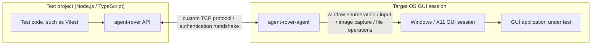

# agent-rover

A multi-platform TypeScript test driver for GUI applications


[](https://github.com/kekyo/agent-rover/)
[](https://www.repostatus.org/#wip)
[](https://opensource.org/licenses/MIT)

---

## What Is This?

Few problems are as painful as automated testing for GUI applications on Windows and X11.
agent-rover provides a driver interface for automated tests written in TypeScript in these environments.

> WIP: X11 agent



agent-rover provides small agent programs that can be used in Windows and X11 environments.
By starting an agent on the target OS, you can remotely operate applications from a Node.js environment through a Jest-like testing interface.
In other words, the operations that we humans perform against applications in a remote session over RDP can be done through an API.

With agent-rover, you can write test code like this:

```typescript
import { writeFile } from 'node:fs/promises';

import { connectRemoteAgent } from 'agent-rover';

// Connect to the remote agent.
const agent = await connectRemoteAgent({
  host: 'test-agent.example.com', // Target host.
  authToken: '<access-token>', // Access token.
});

// Save a file in the remote environment.
await agent.files.writeFile(
  String.raw`C:\test.txt`,
  Buffer.from('test text file')
);

// Launch the application.
const process = await agent.processes.launchManaged({
  path: 'notepad.exe',
});

// Get the application window.
const notepadWindow = await process.waitForWindow({
  visible: true,
});

// Activate the application.
await notepadWindow.activate();

// Enter text by simulating keyboard typing.
await agent.keyboard.pasteText('Here is a remote message');

// Capture the window image and save it.
const screenshot = await notepadWindow.screenshot();
await writeFile('capture.png', screenshot.image);

await process.releaseAsync();
```

In addition to observing and operating GUI applications themselves, agent-rover also includes APIs for operating the target GUI session.
As shown in the example above, you can send and receive files and launch applications.

## Features

- Place the agent application on a remote machine and drive test operations remotely.
- Launch, discover, operate, and inspect the state of target GUI applications.
  File operations, such as sending and receiving files, are also supported.
- Prebuilt agents are available for Windows (i686/amd64 on XP SP2 or later) and Linux X11 (i686/amd64/armv7l/arm64/riscv64).
- Agent communication uses a custom TCP protocol.
  Authentication uses a digest handshake, although the protocol messages themselves are not encrypted.
- Image recognition assertions for exact or close matches, and OCR-based assertions.

---

## Preparation

Download the agent for the target platform from the [releases page](https://github.com/kekyo/agent-rover/releases/).
The agent is very small and avoids runtime dependencies on other libraries as much as possible.
After extracting the archive, you can run it as-is. No installation is required.

For example, you can start the Windows agent as follows.
When it starts, it prints the listening address and access token.
As clients connect and drive applications, it also prints low-frequency
lifecycle events:

```cmd
C:\> agent-rover-agent.exe

agent-rover native windows agent
Copyright (c) Kouji Matsui (@kekyo@mi.kekyo.net)
https://github.com/kekyo/agent-rover
Licence: Under MIT.

agent-rover native agent listening on 0.0.0.0:39397
agent-rover agent token: <access-token>
agent-rover agent event: 2026-07-07T12:34:56Z connection #1 accepted from 192.0.2.10:50123
agent-rover agent event: 2026-07-07T12:34:57Z connection #1 authenticated
agent-rover agent event: 2026-07-07T12:34:57Z connection #1 ready
agent-rover agent event: 2026-07-07T12:35:10Z application launched pid=4321 name=notepad.exe path=notepad.exe
agent-rover agent event: 2026-07-07T12:35:20Z managed process released managedId=1
agent-rover agent event: 2026-07-07T12:35:21Z connection #1 disconnected: peer requested close
```

- When the agent starts, it prints an access token. Make a note of it.
- The lifecycle log reports connection, authentication, application launch,
  managed process kill/release, process kill, and disconnect events. It does not
  print request payloads, access tokens, environment variables, or clipboard
  contents.
- The default TCP port is 39397. You need to open it in the OS firewall.
- The Windows agent must be started from the user's interactive desktop so it can operate the desktop environment.
  This is a subtle issue, but launching a process from a Windows service restricts the desktop environment, so running the Windows agent as a service is not recommended.

Then install agent-rover in your npm project:

```bash
npm install -D agent-rover
```

You can use any test framework.
For example, with Vitest, you can write the following:

```typescript
import { describe, expect, it } from 'vitest';
import { connectRemoteAgent } from 'agent-rover';

describe('remote agent smoke test', () => {
  it('finds a running Notepad window', async () => {
    // Connect to the remote agent.
    const agent = await connectRemoteAgent({
      host: '192.0.2.10',
      authToken: '<access-token>',
    });

    try {
      // Enumerate windows.
      const windows = await agent.windows();
      // Is notepad.exe running?
      const hasNotepad = windows.some((window) => {
        return (
          window.visible && window.process.name.toLowerCase() === 'notepad.exe'
        );
      });
      expect(hasNotepad).toBe(true);
    } finally {
      // Release the remote agent.
      agent.release();
    }
  });
});
```

---

## Documents

For more information, [please visit the repository](https://github.com/kekyo/agent-rover/).

## License

Under MIT.
