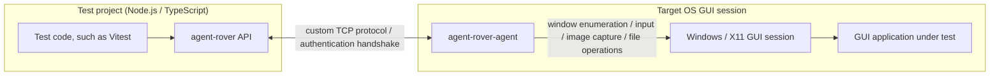

# agent-rover

A multi-platform TypeScript test driver for GUI applications


[](https://github.com/kekyo/agent-rover/)
[](https://www.repostatus.org/#wip)
[](https://opensource.org/licenses/MIT)

---

## What Is This?

Few problems are as painful as automated testing for GUI applications on Windows and X11.
agent-rover provides a driver interface for automated tests written in TypeScript in these environments.

> WIP: X11 agent


```mermaid
flowchart LR
  subgraph TestProject["Test project (Node.js / TypeScript)"]
    TestCode["Test code, such as Vitest"]
    Driver["agent-rover API"]
    TestCode --> Driver
  end

  subgraph TargetSession["Target OS GUI session"]
    Agent["agent-rover-agent"]
    GuiSession["Windows / X11 GUI session"]
    Application["GUI application under test"]
    Agent -->|window enumeration / input / image capture / file operations| GuiSession
    GuiSession --> Application
  end

  Driver <-->|custom TCP protocol / authentication handshake| Agent
```

agent-rover provides small agent programs that can be used in Windows and X11 environments.
By starting an agent on the target OS, you can remotely operate applications from a Node.js environment through a Jest-like testing interface.
In other words, the operations that we humans perform against applications in a remote session over RDP can be done through an API.

With agent-rover, you can write test code like this:

```typescript
import { writeFile } from 'node:fs/promises';

import { connectRemoteAgent } from 'agent-rover';

// Connect to the remote agent.
const agent = await connectRemoteAgent({
  host: 'test-agent.example.com', // Target host.
  authToken: '<access-token>', // Access token.
});

// Save a file in the remote environment.
await agent.files.writeFile(
  String.raw`C:\test.txt`,
  Buffer.from('test text file')
);

// Launch the application.
const process = await agent.processes.launchManaged({
  path: 'notepad.exe',
});

// Get the application window.
const notepadWindow = await process.waitForWindow({
  visible: true,
});

// Activate the application.
await notepadWindow.activate();

// Enter text by simulating keyboard typing.
await agent.keyboard.pasteText('Here is a remote message');

// Capture the window image and save it.
const screenshot = await notepadWindow.screenshot();
await writeFile('capture.png', screenshot.image);

await process.releaseAsync();
```

In addition to observing and operating GUI applications themselves, agent-rover also includes APIs for operating the target GUI session.
As shown in the example above, you can send and receive files and launch applications.

## Features

- Place the agent application on a remote machine and drive test operations remotely.
- Launch, discover, operate, and inspect the state of target GUI applications.
  File operations, such as sending and receiving files, are also supported.
- Capture the screen or an application window as a PNG image, or as an H.264
  MP4 video on a supported Windows agent.
- Prebuilt agents are available for Windows (i686/amd64 on XP SP2 or later) and Linux X11 (i686/amd64/armv7l/arm64/riscv64).
- Agent communication uses a custom TCP protocol.
  Authentication uses a digest handshake, although the protocol messages themselves are not encrypted.
- Image recognition assertions for exact or close matches, and OCR-based assertions.

---

## Preparation

Download the agent for the target platform from the [releases page](https://github.com/kekyo/agent-rover/releases/).
The agent is very small and avoids runtime dependencies on other libraries as much as possible.
After extracting the archive, you can run it as-is. No installation is required.

Start the Windows agent from your interactive desktop. It runs in the system tray.

```cmd
C:\> agent-amd64.exe
```

Double-click the tray icon or choose “Show logs” to open the viewer.
The version banner and copyable token field appear above the log list.
Copy the token into the driver's `authToken` option.
Closing the viewer keeps the agent running; choose “Exit” from the tray to stop it.
The Windows agent has no console output, so Quick Edit needs no configuration.

The resizable list shows the latest 1,000 records. Older records are saved as
UTF-8 files in `%APPDATA%\agent-rover\logs`. Choose “Open log folder” from the
tray to browse them. Normally, five files of up to 10 MiB each are retained.
Active files belonging to other instances are preserved, so concurrent instances
can exceed five files in total. The status area reports save failures and records
that were dropped or whose persistence could not be confirmed.

Logs include connection, authentication and process events, request IDs and
methods, execution results, response transmission and elapsed time. Sequence
numbers match between the viewer and files. Authentication tokens, request
bodies, environment variables and clipboard contents are not copied to logs.

- The default TCP port is 39397. Open it in the OS firewall.
- Start the Windows agent from the user's interactive desktop. Running it as a Windows service is not supported.
- Driver requests have a default deadline of 30 seconds. An expired request closes the entire connection and cancels its queued operations. Reconnect to continue. Side effects already submitted to the target application cannot be undone.
- Windows operation budgets are 30 seconds for windows, input and clipboard, and normally 120 seconds for other operations. Recording is limited to ten minutes; result retrieval allows the recording duration plus 120 seconds.
- Windows accepts up to 16 connections and reserves operation workers for up to eight connections. Unrecoverable operations retain their slots and are recorded in the log.
- Whole-file reads and the combined incoming transfer data retained per connection are limited to 64 MiB by default. Set `--max-transfer-size 128` at agent startup to change the limit to a positive integer number of MiB. The same limit applies when retrieving captured stdout or stderr.
- Each Windows connection can own up to 64 managed processes. Split larger workloads.
- H.264 MP4 recording is available when the Windows agent advertises
  `agent.recordVideo` and `window.recordVideo`. It requires the Windows
  [Media Foundation Sink Writer](https://learn.microsoft.com/en-us/windows/win32/api/mfreadwrite/nf-mfreadwrite-mfcreatesinkwriterfromurl)
  and a compatible
  [H.264 encoder](https://learn.microsoft.com/en-us/windows/win32/medfound/h-264-video-encoder).

Then install agent-rover in your npm project:

```bash
npm install -D agent-rover
```

You can use any test framework.
For example, with Vitest, you can write the following:

```typescript
import { describe, expect, it } from 'vitest';
import { connectRemoteAgent } from 'agent-rover';

describe('remote agent smoke test', () => {
  it('finds a running Notepad window', async () => {
    // Connect to the remote agent.
    const agent = await connectRemoteAgent({
      host: '192.0.2.10',
      authToken: '<access-token>',
    });

    try {
      // Enumerate windows.
      const windows = await agent.windows();
      // Is notepad.exe running?
      const hasNotepad = windows.some((window) => {
        return (
          window.visible && window.process.name.toLowerCase() === 'notepad.exe'
        );
      });
      expect(hasNotepad).toBe(true);
    } finally {
      // Release the remote agent.
      agent.release();
    }
  });
});
```

---

## Documents

For more information, [please visit the repository](https://github.com/kekyo/agent-rover/).

## License

Under MIT.
