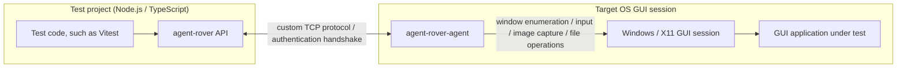

# agent-rover

A multi-platform TypeScript test driver for GUI applications


[](https://github.com/kekyo/agent-rover/)
[](https://www.repostatus.org/#wip)
[](https://opensource.org/licenses/MIT)

---

## What Is This?

Few problems are as painful as automated testing for GUI applications on Windows and X11.
agent-rover provides a driver interface for automated tests written in TypeScript in these environments.

> WIP: X11 agent


```mermaid
flowchart LR
  subgraph TestProject["Test project (Node.js / TypeScript)"]
    TestCode["Test code, such as Vitest"]
    Driver["agent-rover API"]
    TestCode --> Driver
  end

  subgraph TargetSession["Target OS GUI session"]
    Agent["agent-rover-agent"]
    GuiSession["Windows / X11 GUI session"]
    Application["GUI application under test"]
    Agent -->|window enumeration / input / image capture / file operations| GuiSession
    GuiSession --> Application
  end

  Driver <-->|custom TCP protocol / authentication handshake| Agent
```

agent-rover provides small agent programs that can be used in Windows and X11 environments.
By starting an agent on the target OS, you can remotely operate applications from a Node.js environment through a Jest-like testing interface.
In other words, the operations that we humans perform against applications in a remote session over RDP can be done through an API.

With agent-rover, you can write test code like this:

```typescript
import { writeFile } from 'node:fs/promises';

import { connectRemoteAgent } from 'agent-rover';

// Connect to the remote agent.
const agent = await connectRemoteAgent({
  host: 'test-agent.example.com', // Target host.
  authToken: '<access-token>', // Access token.
});

// Save a file in the remote environment.
await agent.files.writeFile(
  String.raw`C:\test.txt`,
  Buffer.from('test text file')
);

// Launch the application.
const process = await agent.processes.launchManaged({
  path: 'notepad.exe',
});

// Get the application window.
const notepadWindow = await process.waitForWindow({
  visible: true,
});

// Activate the application.
await notepadWindow.activate();

// Enter text by simulating keyboard typing.
await agent.keyboard.pasteText('Here is a remote message');

// Capture the window image and save it.
const screenshot = await notepadWindow.screenshot();
await writeFile('capture.png', screenshot.image);

await process.releaseAsync();
```

In addition to observing and operating GUI applications themselves, agent-rover also includes APIs for operating the target GUI session.
As shown in the example above, you can send and receive files and launch applications.

## Features

- Place the agent application on a remote machine and drive test operations remotely.
- Launch, discover, operate, and inspect the state of target GUI applications.
  File operations, such as sending and receiving files, are also supported.
- Capture the screen or an application window as a PNG image, or as an H.264
  MP4 video on a supported Windows agent.
- Prebuilt agents are available for Windows (i686/amd64 on XP SP2 or later) and Linux X11 (i686/amd64/armv7l/arm64/riscv64).
- Agent communication uses a custom TCP protocol.
  Authentication uses a digest handshake, although the protocol messages themselves are not encrypted.
- Image recognition assertions for exact or close matches, and OCR-based assertions.

---

## Preparation

Download the agent for the target platform from the [releases page](https://github.com/kekyo/agent-rover/releases/).
The agent is very small and avoids runtime dependencies on other libraries as much as possible.
After extracting the archive, you can run it as-is. No installation is required.

Start the Windows agent from your interactive desktop. It runs in the system tray.

```cmd
C:\> agent-amd64.exe
```

Double-click the tray icon or choose “Show logs” to open the viewer.
The version banner and copyable token field appear above the log list.
Copy the token into the driver's `authToken` option.
Closing the viewer keeps the agent running; choose “Exit” from the tray to stop it.

Logs include connection, authentication and process events, request IDs and
methods, execution results, response transmission and elapsed time. Sequence
numbers match between the viewer and files. Authentication tokens, request
bodies, environment variables and clipboard contents are not copied to logs.

The default TCP port is 39397. Open it in the OS firewall.
Start the Windows agent from the user's interactive desktop. Running it as a Windows service is not supported.

Then install agent-rover in your npm project:

```bash
npm install -D agent-rover
```

You can use any test framework.
For example, with Vitest, you can write the following:

```typescript
import { describe, expect, it } from 'vitest';
import { connectRemoteAgent } from 'agent-rover';

describe('remote agent smoke test', () => {
  it('finds a running Notepad window', async () => {
    // Connect to the remote agent.
    const agent = await connectRemoteAgent({
      host: '192.0.2.10',
      authToken: '<access-token>',
    });

    try {
      // Enumerate windows.
      const windows = await agent.windows();
      // Is notepad.exe running?
      const hasNotepad = windows.some((window) => {
        return (
          window.visible && window.process.name.toLowerCase() === 'notepad.exe'
        );
      });
      expect(hasNotepad).toBe(true);
    } finally {
      // Release the remote agent.
      agent.release();
    }
  });
});
```

---

### Agent Limits (Advanced topic)

Driver requests have a default deadline of 30 seconds. An expired request closes
the entire connection and cancels its queued operations.
Reconnect to continue. Side effects already submitted to the target application
cannot be undone.

Windows operation budgets are 30 seconds for windows, input and clipboard, and
normally 120 seconds for other operations.
Recording is limited to ten minutes; result retrieval allows the recording
duration plus 120 seconds.

Windows accepts up to 16 connections and reserves operation workers for up to
eight connections. Capture directories are limited to 64 connections, including
active and pending recovery.
At capacity, new captures and recordings cannot start; operations that do not
require captured output remain available.

Whole-file reads and the combined incoming transfer data retained per connection
are limited to 64 MiB by default.
Set `--max-transfer-size 128` at agent startup to change the limit to a positive
integer number of MiB. The same limit applies when retrieving captured stdout
or stderr.

Each Windows connection can own up to 64 managed processes. Split larger workloads.

H.264 MP4 recording is available when the Windows agent advertises
`agent.recordVideo` and `window.recordVideo`. It requires the Windows
[Media Foundation Sink Writer](https://learn.microsoft.com/en-us/windows/win32/api/mfreadwrite/nf-mfreadwrite-mfcreatesinkwriterfromurl)
and a compatible
[H.264 encoder](https://learn.microsoft.com/en-us/windows/win32/medfound/h-264-video-encoder).

### Process Supervision And Management (Advanced topic)

An independent supervisor starts with the agent. If the host stops making progress
for 15 seconds or exits unexpectedly, the supervisor confirms termination and
restarts it. Startup has a 30-second allowance.

Automatic host restarts retain the authentication token, port, transfer limit
and other startup settings.
Reconnect the driver to continue; requests from the disconnected session are
never replayed.

Starts are limited to three in any 60-second period, with delayed retries after
repeated failures. Choosing “Exit” stops both the host and its supervisor.

TCP disconnects stop the session's work and reclaim managed application trees
that are configured to terminate. Once termination is confirmed, other connections
can operate even if capture-file deletion fails; file cleanup retries independently.

Applications with `killTreeOnRelease: false` keep running. Their captured output
is retained while it is still in use. Pending recovery survives automatic host restarts.
Logs record restart reasons and the failing cleanup stage and path, including
directories that could not be removed at shutdown.

A replacement host waits until the old processes have been confirmed stopped.
Automatic recovery does not cover an OS-wide failure or termination of the
supervisor itself.

### Log Management (Advanced topic)

The resizable list shows the latest 1,000 records. Older records are saved as
UTF-8 files in `%APPDATA%\agent-rover\logs`.

Choose “Open log folder” from the tray to browse them.
Normally, five files of up to 10 MiB each are retained.
Active files belonging to other instances are preserved, so concurrent instances
can exceed five files in total.

The status area reports save failures and records that were dropped or whose
persistence could not be confirmed.

---

## Manual Operations With arctl

`arctl` is a client for manual debugging, included in the agent-rover package.
It runs on Node.js 20 or later. Each invocation connects, performs one operation,
and disconnects, leaving launched applications, transferred files, and saved
captures in place. Start the Windows agent on the target using the steps above.
The Windows agent on the target does not require Node.js.

Install globally to run `arctl` directly:

```bash
npm install -g agent-rover
arctl --help
```

For a project installation with `npm install -D agent-rover`, use `npx arctl`.
Help such as `arctl --help` and `arctl record --help`, and `arctl --version`,
work without a connection.

### Connection And Examples

These examples use Bash. Set the authentication token to the value shown by the agent.

```bash
export AGENT_ROVER_HOST=192.0.2.10
export AGENT_ROVER_AUTH_TOKEN='...'

arctl put ./app.exe 'C:\work\app.exe'
arctl launch --cwd 'C:\work' -- 'C:\work\app.exe' --debug
arctl get 'C:\work\result.log' ./result.log
arctl put -r ./runtime 'C:\work\runtime'
arctl get -r 'C:\work\results' ./results

arctl windows
arctl screenshot ./screen.png
arctl record ./screen.mp4 --seconds 10 --fps 30
arctl screenshot ./window.png --window 0x12345
arctl record ./window.mp4 --seconds 10 --window 0x12345
```

Replace the example window ID with a value from `arctl windows`.
In PowerShell, set the connection with `$env:AGENT_ROVER_HOST = '192.0.2.10'`
and `$env:AGENT_ROVER_AUTH_TOKEN = '...'`.

| Common option | Environment variable | Default and purpose |
| :-- | :-- | :-- |
| `--host <HOST>` | `AGENT_ROVER_HOST` | Required through either setting. |
| `--port <PORT>` | `AGENT_ROVER_PORT` | `39397`; an integer from 1 to 65535. |
| `--token <TOKEN>` | `AGENT_ROVER_AUTH_TOKEN` | Authentication token; optional for agents without authentication. |
| `--timeout <SECONDS>` | None | Connection and individual request deadline; defaults to 30 seconds. |
| `--json` | None | Prints success as `{"command":"...","result":...}`. |

Common options can precede or follow the subcommand and override environment variables.
The recording duration itself is separate from the request deadline.
`--timeout` accepts 0.001 to 2147483.647 seconds, matching the
[Node.js timer range](https://nodejs.org/docs/latest-v24.x/api/timers.html#settimeoutcallback-delay-args).

### Command Behavior

| Command | Behavior and options |
| :-- | :-- |
| `launch [options] -- <command> [args...]` | Starts an application, prints its PID and process name, and exits. Supports `--cwd`, repeatable `--env KEY=VALUE`, and remote log paths with `--stdout` and `--stderr`. |
| `put [-r] <local> <remote>` | Copies from local to remote. |
| `get [-r] <remote> <local>` | Copies from remote to local. |
| `windows` | Lists IDs, PIDs, process names, and titles of visible top-level windows. |
| `screenshot <output.png> [--window ID]` | Saves a PNG locally. |
| `record <output.mp4> --seconds N [--window ID] [--fps N]` | Saves an H.264 MP4 locally. Duration must be greater than 0 and at most 600 seconds, in millisecond increments. FPS is an integer from 1 to 240, defaulting to 60. |

`launch` requires `--` before the executable. Everything after it, including
options such as `--help`, is passed to the child process. Environment values
can be empty or contain `=`; the last value wins for a repeated name.
The CLI exits when startup succeeds, without waiting for application readiness
or completion. Explicitly launch `cmd.exe` or `powershell.exe` when you need shell syntax.
Logs are not streamed to the client; retrieve saved logs with `get`.

For a single file, specify the full destination filename. Existing files are
overwritten and parent directories are created. With `-r`, directory contents,
including empty directories, are copied into the exact destination without
appending the source directory name. Destination-only entries remain.
A file/directory type conflict fails without deleting the existing item.
Attributes, links, differential synchronization, and transfer resumption are
not supported. Remote paths are resolved on the target; absolute paths are recommended.

Omitting `--window` captures all monitors of the current desktop. There is no
special ID for the whole screen. Window IDs become invalid when their windows
close and can be reused. Unknown IDs fail instead of selecting the whole screen.
Captures contain the pixels currently visible, including overlapping windows.
The CLI does not activate or restore windows, or wait for drawing to settle.
Capture output paths are local; parent directories are created, and existing
files are never overwritten. Recording uses quality 90, follows the window's
position, and uses its initial size. It waits for capture, transfer, and saving
to complete. Unsupported recording and encoding failures are reported as errors.

### Results And Interruption

Success results go to stdout and errors to stderr, including with `--json`.
Exit codes are `0` for success, `1` for connection or operation failure,
`2` for invalid arguments, and `130` for Ctrl+C.
If a disconnect or deadline leaves the outcome unknown, the CLI reports that
uncertainty and does not retry the operation automatically.
Applications already started, files already transferred, and completed captures
remain after interruption or failure. Restoring a partially written file is not
guaranteed. Interrupting a recording does not wait for its remaining duration,
but a playable partial MP4 is not guaranteed.

---


## Documents

For more information, [please visit the repository](https://github.com/kekyo/agent-rover/).

## License

Under MIT.
